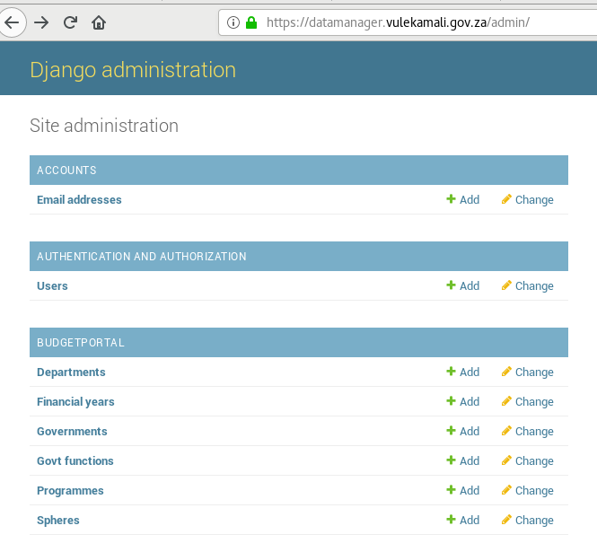
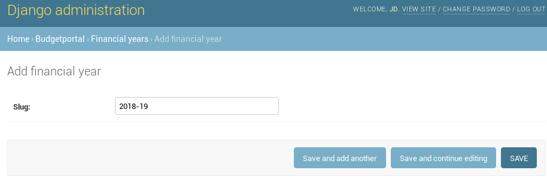
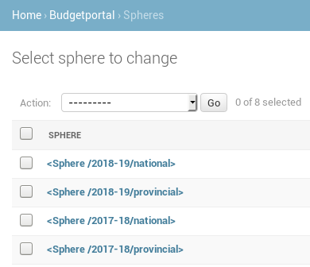
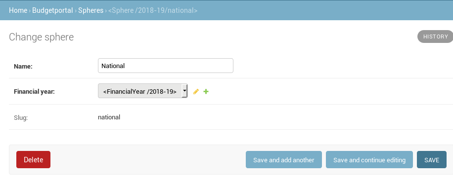
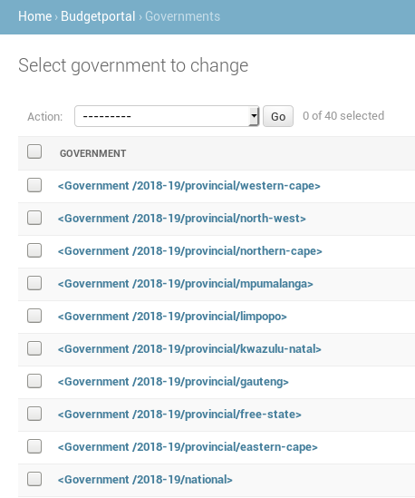
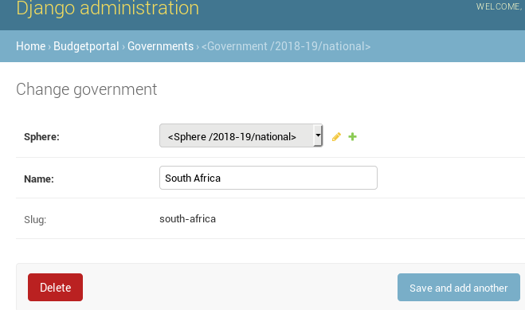
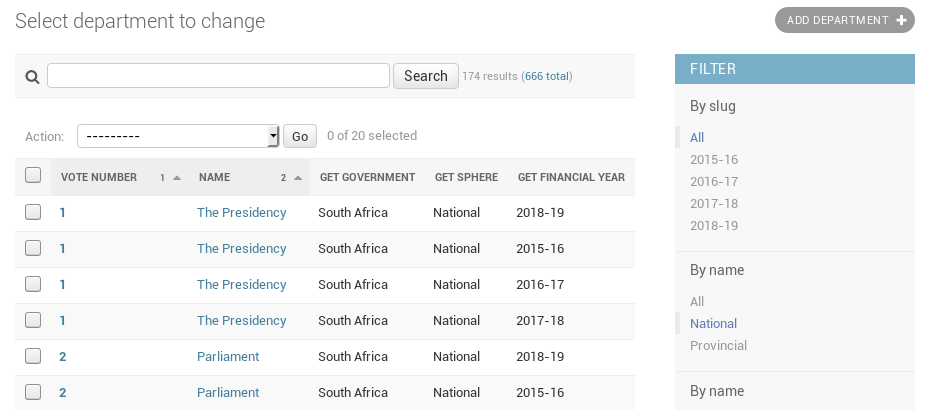
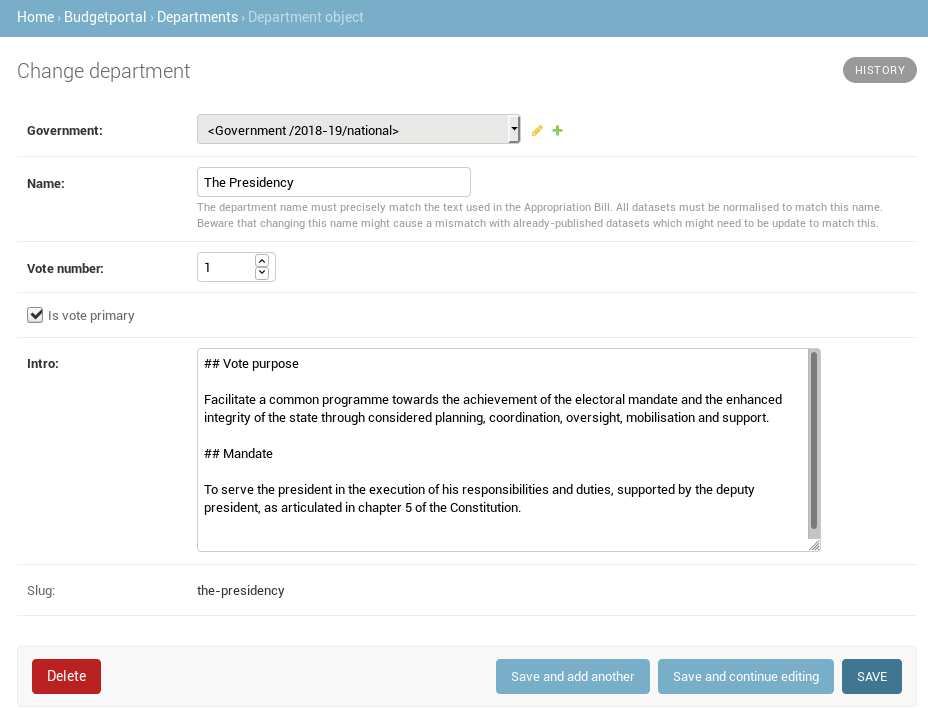

# Adding a new national budget

The following is required to add a new budget to vulekamali

* The [new financial year, sphere, government, and departments must be added to the Data Manager](./#adding-the-new-financial-year-sphere-government-and-departments)
* The [ENE Vote e-publications and accompanying per-vote Excel files must be added to the Datastore](../adding-modifying-information-on-the-site/bulk-uploading-department-specific-documents.md#estimates-of-national-expenditure-vote-chapters)
* The [ENE Expenditure dataset must be added to OpenSpending, and the data on OpenSpending added  to the Datastore](../adding-modifying-information-on-the-site/adding-structured-fiscal-data-to-openspending.md#estimates-of-national-expenditure)
* The [Division of Revenue Bill must be added to the Datastore](adding-a-new-division-of-revenue-bill.md)
* The [Revenue Sources Estimates must be added to the Datastore and referenced in an update to the Data Manager](adding-a-new-national-budget-adding-revenue-sources-data.md)
* The[ new CPI Inflation dataset must be added to the Datastore](adding-cpi-inflation-data.md)
* The Consolidated Spending Summary must be added to the Datastore
* New Additional Resource links must be added to vulekamali
* The current financial year and visible years must be updated in vulekamali
* The data for vulekamali must be rebuilt, previewed, and uploaded when ready to publish the updated site.

## Adding the new financial year, sphere, government, and departments

The new financial year, sphere, government, and departments must be added to the Data Manager

These items are added using the Data Manager admin interface

The "Slug" of a financial year is the hyphenated form, e.g. 2019-20

Spheres are repeated each financial year to help structure the data

In this case, add the National sphere. Select the the new financial year that the sphere is related to.

Each sphere has at least one government that the departments are part of

Add the new government. The government and sphere are used to identify data and documents specific to national government, as opposed to consolidated national and provincial finances together.

Departments are related to the government as defined in a given financial year. That helps to distinguish information related to a department's configuration in that year, and show historical information following function shifts.

Departments can be added using the admin form. Since it can take a lot of time to add all the metadata for all the departments, [this can be done in bulk](https://github.com/OpenUpSA/vulekamali-datamanager#loading-departments-in-bulk).

* Departments that represent a budget vote must have _Is vote primary_ checked. Departments that are part of another department's budget vote must not, and must have the vote department's vote number.
* The department Introduction can be formatted using [Markdown syntax](https://daringfireball.net/projects/markdown/syntax)

