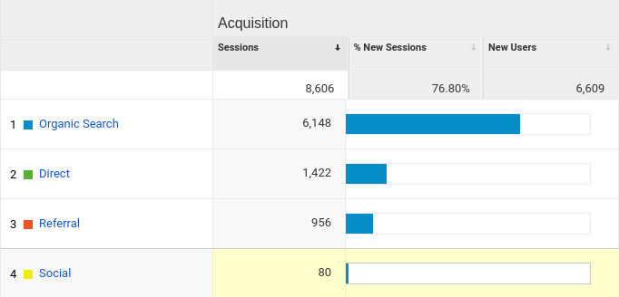
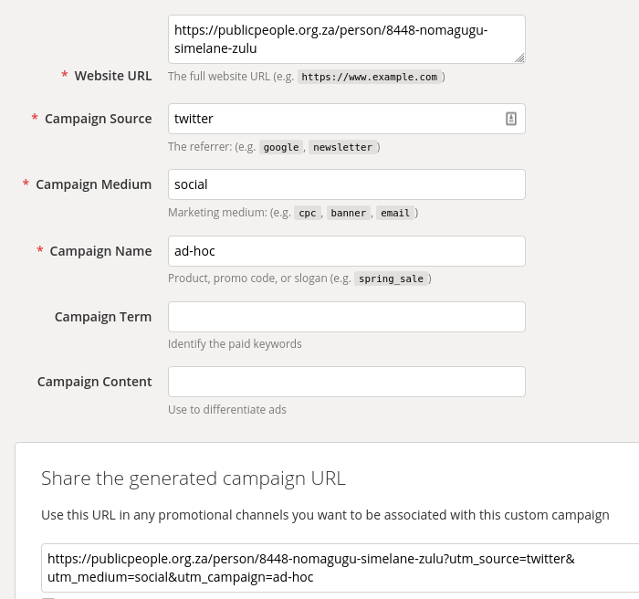
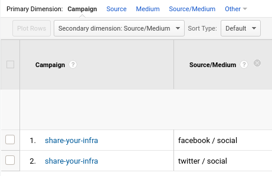

# Communications

## [Facebook](https://business.facebook.com/vulekamali/) 

The addition of admin from National Treasury is required by 31 July 2020

## [Twitter](https://twitter.com/vulekamali)

The addition of admin from National Treasury is required by 31 July 2020

## Mailing List

## Tracking app and campaign web traffic sources

It is important to understand where traffic to the site comes from to understand what kind of marketing is effective and what is wasting effort or could be improved.

Google Analytics provides a range of data about traffic sources, but is often not totally correct. 

* The classification Organic Search refers to visitors who come from a known search engine. 
* Referral refers to traffic from websites other than search engines, e.g. treasury.gov.za. 
* Social refers to traffic from social network sites like Twitter's website. 
* The Direct category refers to traffic that does not come from another website \(search engine or otherwise\). That basically means people who typed in the web address or found it in their bookmarks, but also traffic when the link was shared and clicked in apps like WhatsApp or the Twitter app.

You can improve the classification of traffic source - e.g. twitter - by adding [UTM URL parameters](https://support.google.com/analytics/answer/1033863) for links shared on social media and other marketing. This also allows you to identify a specific marketing campaign.

Tools like [this one](https://ga-dev-tools.appspot.com/campaign-url-builder/) shown below allow you to paste a URL that you want to share, and automatically add the parameters to a URL that you can just copy and use once you filled in the values. 

For example, let's say we want to promote the infrastructure projects feature homepage [https://vulekamali.gov.za/infrastructure-projects/full/](https://vulekamali.gov.za/infrastructure-projects/full/). We are running a campaign on sending photos of projects, so we will call it share-your-infra. The URL it generates for Facebook is [https://vulekamali.gov.za/infrastructure-projects/full/?utm\_source=facebook&utm\_medium=social&utm\_campaign=share-your-infra](https://vulekamali.gov.za/infrastructure-projects/full/?utm_source=facebook&utm_medium=social&utm_campaign=share-your-infra) and for Twitter is [https://vulekamali.gov.za/infrastructure-projects/full/?utm\_source=twitter&utm\_medium=social&utm\_campaign=share-your-infra](https://vulekamali.gov.za/infrastructure-projects/full/?utm_source=twitter&utm_medium=social&utm_campaign=share-your-infra).


Watch out - if you use the same generated URL on various platforms, it will misattribute the source since these parameters take precedence.


With this information in the URL, you have it available for analysing traffic in Google Analytics

 

