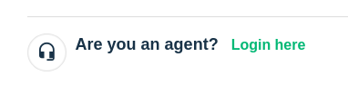
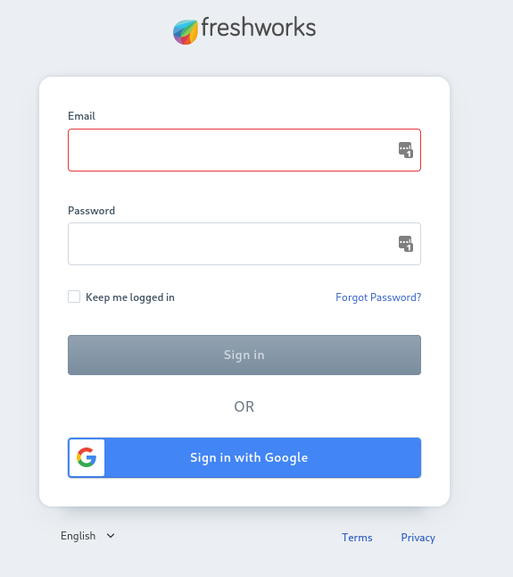
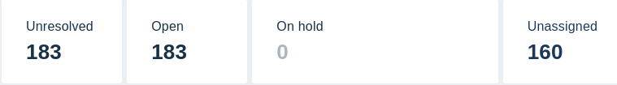

# Support desk

vulekamali has a Support Desk for tracking and responding to user messages.

A Support Tesk creates a "ticket" for every email thread with a user. It also tracks the amount of time the user has been waiting for a response, making it easy to see how responsive we are.

You can easily see a list of unresolved tickets, representing discussions with users that have not been concluded.

Once a discussion is concluded, the ticket should be "closed" so that it is clear that it has been resolved.

## Logging in to the support desk

Visit the [Login Page](https://vulekamali.freshdesk.com/support/login)

Use the **Are you an agent?** link, rather than the login form above it, which is for users of the site.

We document this step rather than linking straight to the login form because this is where you land when you follow links from notification emails as well.

After logging in, you will usually want to go to Unresolved Tickets.

## Unresolved tickets

You visit unresolved ticket list by clicking on the Ticket button in the menu, or on the **Unresolved** number from the dashboard.

## Agents

Agents can be managed by clicking on Agents in the General Settings menu. Access this by clicking the Cog icon in the main menu.

