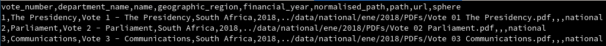

# Data Formats

## CSV \(Comma-separated values\)

A CSV is a plain text file \(you could open it in Notepad\) with some common conventions for storing tabular data.

CSV is very commonly used for tabular data from a few rows, to many gigabytes of data. It is useful for extremely large datasets because it can be processed in small chunks at a time - data tools using CSV don't need to read the entire file at once.

We follow the following conventions, as expected by common tools:

* Encode the file as UTF-8
* Use comma `,` as field delimiter
* Use double-quote `"` to denote fields that contain commas in the value, to avoid that comma being interpreted as a field delimiter
  * e.g. `1,some-text,"Some text, which has a comma"` denotes three columns with values
    * `1`
    * `some-text`
    * `Some text, which has a comma`
* Fields that contain only a number \(without spaces\) are assumed to be numeric fields. If they should be interpreted as text, they should be quoted.
  * `12345` is a number
  *      `12345` is text
  * `"12345"` is the text `12345`
* Use `""` to denote a doule-quote in a field that contains a quote. 
  * e.g. `"This has a comma, and a quote "" and is just one field"`
* Multiline values must be quoted

See also [https://en.wikipedia.org/wiki/Comma-separated\_values\#RFC\_4180\_standard](https://en.wikipedia.org/wiki/Comma-separated_values#RFC_4180_standard)

