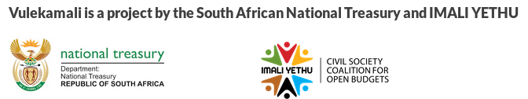

# Style/brand guide

## Logos

National Treasury and Imali Yethu's logos should be presented together along with the text _"Vulekamali is a project by the South African National Treasury and IMALI YETHU"_, e.g. in footers:

## Soliciting input/feedback/comment

Only solicit input when certain that National Treasury is able to process that input. This must be decided based on the content on the page. e.g.

* Budget and spending data: National Treasury reviews the correctness of the data and will inform submitting departments of mistakes
* Provincial infrastructure project data: National Treasury does not check the correctness of the data - questions about the correctness should be directed to the relevant provincial treasury and not to National Treasury.


It is harmful to give the impression that a space for contacting government is provided if that will never be handled. Be careful not to give the impression that comment will be received if it will never be handled. This risks demoralising active citizens by giving the impression of unresponsive government. Rather direct contact to the place where it should actually be received.


