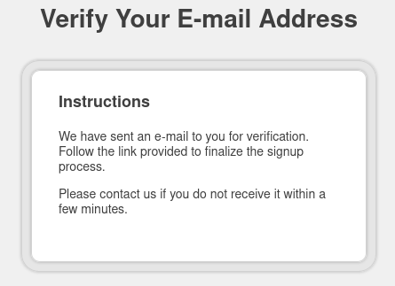
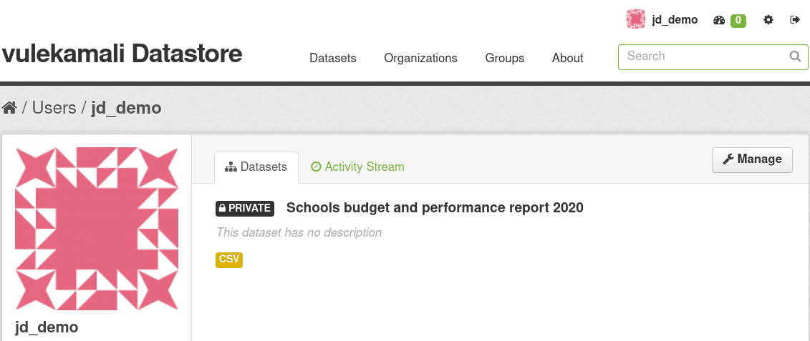

# Contributed Data

## Uploading as a contributor

### Create a contributor account

Visit the Contributed Data index in the Data and Analysis section.

Click on Log in and submit your data. You can create an account on the next page.

Click on Create account

Complete signing up, check your email inbox for the confirmation email.

 Click the confirmation link to confirm that that is your email address.

The confirmation link will take you to the Create Dataset page. Follow the instructions to create and upload your first dataset.

After creating your first dataset, you will be prompted to join your organisation at the top of the dataset page

If your organisation is already on vulekamali, visit their page and request to join, otherwise request to add your organisation.

National Treasury will receive your request and respond. You can also follow up on your request at [info@vulekamali.gov.za](mailto:info@vulekamali.gov.za)

In the meantime, you can continue uploading and documenting your datasets. You will not be able to make them public until you are part of an organisation.

Once they have added you to your organisation, you will be able to make your datasets public.

Visit the list of your datasets by clicking on your username at the top right.

Edit the dataset by clicking Manage at the top right.

Add it to your organisation

Your dataset should show up in search results and on the contributed dataset within a few minutes.

## Operations for administrators

### Receiving requests

Get yourself added to

* [Budget Portal - Add your organisation \(Responses\)](https://docs.google.com/spreadsheets/d/1VQmoAQVf4rskF48JXmY1OIEnBj4QMholLQ-wNPp0tbw/edit#gid=246380462)
* [Budget Portal - Join your organisation on data.vulekamali.gov.za \(Responses\)](https://docs.google.com/spreadsheets/d/1HDk_qsZohpmBRNQICbCIRMU4BivWs4s6569vCH9re1Y/edit#gid=246380462)

Sign up for email notifications of form submissions under Tools &gt; Notifications.

### Handling requests

To be able to contribute data/analyses, a contributor must be added to an organisation for which they are authorised to publish on vulekamali.

If their organisation exists, they should just be added as an Admin or an Editor. If their organisation does not exist yet, first create the organisation. They ought to submit a form which sends its result to [an online spreadsheet with the details of their organisation](https://docs.google.com/spreadsheets/d/1VQmoAQVf4rskF48JXmY1OIEnBj4QMholLQ-wNPp0tbw/edit#gid=246380462).

Before adding an organisation, National Treasury has to authorise the organisation to be added. Do not add an organisation without this approval.

1. [Double-check that the organisation does not exist yet](https://data.vulekamali.gov.za/organization)
2. Add the organisation
3. Update their contact details on the edit page for the organisation
4. Add any approved members with the appropriate roles
5. Ensure that any datasets they have already added are now owned by the organisation and marked Public.
6. E-mail them to let them know.

