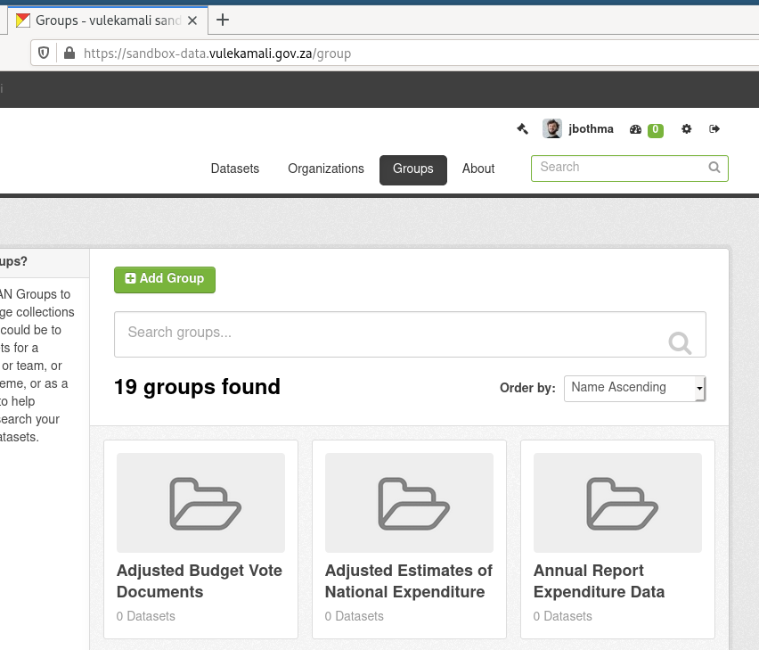
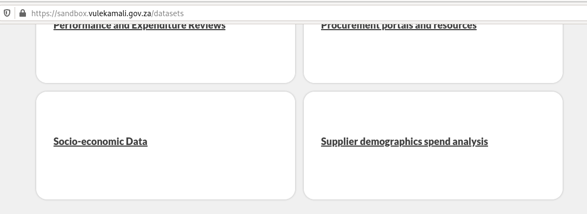

# Adding a new dataset category

The dataset categories on vulekamali are the top level groups in the datasets section. You might need to create a new one if there's a new type of data being added. Note that data categories are for different types of data in the sense of Expenditure vs Revenue vs Performance - not to distinguish formats like PDF and Excel.



Dataset categories are represented by _**groups**_  in CKAN.

To create a new category, click Add Group at the top of the groups page in CKAN, then give it a clear concise name. The slug field will be filled in automatically and will usually be fine to use as-is.

After clicking Create Group on the new group form, you can add datasets to it and it should show up on the Datasets page on vulekamali.


It might take a few minutes for a new group to show up in the dataset category index. Just reload after about 5 minutes to give the cache time to expire and let the page update.


