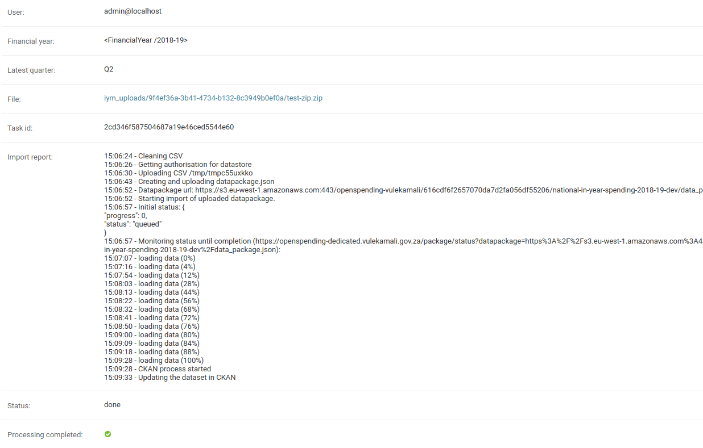

# In-year spending data

The in-year spending data is quarterly updates of monthly spend actuals. You can find the details of the format of the file that should be uploaded below. Also [see the dataset guide](https://vulekamali.gov.za/learning-resources/guides/-year-spending-data/) for details of fields and what's expected.

## Enabling the feature

The feature is disabled upon release, to be enabled when the data is all uploaded and ready for presentation.

Once ready for use, enable presentation of the data in charts using the IN\_YEAR\_SPENDING\_ENABLED [Constance Config option](../../site-wide-options.md)

## Uploading the data

To upload IYM data using the CMS, click the "Add" button next to "Iym file uploads"

<figure><figcaption></figcaption></figure>

In the upload page select the financial year, latest quarter and the file to be uploaded. Selected file must be a zip file containing the data csv\

<figure><figcaption></figcaption></figure>

Csv file needs to contain these columns

* Vote No#&#x20;
* Department&#x20;
* Programme No#&#x20;
* Programme&#x20;
* Subprogramme No#&#x20;
* Subprogramme econClass\_L1&#x20;
* econClass\_L2&#x20;
* econClass\_L3&#x20;
* econClass\_L4
* econClass\_L5&#x20;
* IYM\_econLowestLevel&#x20;
* Item\_Lowest\_Level&#x20;
* Assets\_Level\_1&#x20;
* Assets\_Level\_2&#x20;
* Assets\_Level\_3&#x20;
* Assets\_Level\_4&#x20;
* Assets\_Level\_5&#x20;
* Assets\_Level\_6&#x20;
* Assets\_Lowest\_Level&#x20;
* Project\_Level\_1&#x20;
* Project\_Level\_2&#x20;
* Project\_Level\_3&#x20;
* Project\_Level\_4&#x20;
* Project\_Level\_5&#x20;
* Project\_Level\_6&#x20;
* Project\_Level\_7&#x20;
* Project\_Level\_8&#x20;
* Project\_Level\_9&#x20;
* Project\_Level\_10&#x20;
* Project\_Level\_11&#x20;
* Project\_Lowest\_Level&#x20;
* Responsibility\_Level\_2&#x20;
* Responsibility\_Level\_3&#x20;
* Responsibility\_Level\_4&#x20;
* Responsibility\_Level\_5&#x20;
* Responsibility\_Level\_6&#x20;
* Responsibility\_Level\_7&#x20;
* Responsibility\_Level\_8&#x20;
* Responsibility\_Level\_9&#x20;
* Responsibility\_Level\_10&#x20;
* Responsibility\_Level\_11&#x20;
* Responsibility\_Level\_12&#x20;
* Responsibility\_Level\_13&#x20;
* Responsibility\_Level\_14&#x20;
* Responsibility\_Level\_15&#x20;
* Responsibility\_Lowest\_Level&#x20;
* Fund\_Level\_1&#x20;
* Fund\_Level\_2&#x20;
* Fund\_Level\_3&#x20;
* Fund\_Level\_4&#x20;
* Fund\_Level\_5&#x20;
* Fund\_Level\_6&#x20;
* Fund\_Level\_7&#x20;
* Fund\_Level\_8&#x20;
* Fund\_Lowest\_Level&#x20;
* Infrastructure\_Level\_1&#x20;
* Infrastructure\_Level\_2
* Infrastructure\_Level\_3&#x20;
* Infrastructure\_Level\_4&#x20;
* Infrastructure\_Level\_5&#x20;
* Infrastructure\_Level\_6&#x20;
* Infrastructure\_Lowest\_Level&#x20;
* Item\_Level\_1&#x20;
* Item\_Level\_2&#x20;
* Item\_Level\_3&#x20;
* Item\_Level\_4&#x20;
* Item\_Level\_5&#x20;
* Item\_Level\_6&#x20;
* Item\_Level\_7&#x20;
* Item\_Level\_8&#x20;
* Regional\_ID\_Level\_1&#x20;
* Regional\_ID\_Level\_2&#x20;
* Regional\_ID\_Level\_3&#x20;
* Regional\_ID\_Level\_4&#x20;
* Regional\_ID\_Level\_5&#x20;
* Regional\_ID\_Level\_6&#x20;
* Regional\_ID\_Level\_7&#x20;
* Regional\_ID\_Level\_8&#x20;
* Regional\_ID\_Lowest\_Level&#x20;
* Budget&#x20;
* AdjustmentBudget&#x20;
* April&#x20;
* May&#x20;
* June&#x20;
* July&#x20;
* August&#x20;
* September
* October&#x20;
* November&#x20;
* December&#x20;
* January&#x20;
* February&#x20;
* March
* Q1&#x20;
* Q2&#x20;
* Q3&#x20;
* Q4&#x20;
* Financial\_Year

Here is an example zip file containing a csv :&#x20;



Once you select the financial year, latest quarter and the file to be uploaded clicking "Save" button will start the upload process. The file will be uploaded to Openspending.&#x20;


A dataset will be created in the CKAN and the url of the file will be added as a resource to the CKAN dataset. Subsequent uploads for the same financial year will replace the data in OpenSpending and update latest\_quarter property of the dataset.


<figure><figcaption></figcaption></figure>

Upload the quarterly zip file and Excel PowerPivot to the dataset in CKAN for people who want to download the whole file. Name the _file_ and _resource_ according to the sphere and latest financial year and quarter included - e.g. `National in-year spending 2019-20 Quarter 2`

## Troubleshooting

### Error: Selection is not a valid field or field index: _column-name_

This can happen when an expected column is not found. That can occur when the file is formatted incorrectly, e.g. when semicolons are used as the field separator instead of comma. See the CSV Formatting guidelines [https://maintenance.vulekamali.gov.za/design/data-formats](https://maintenance.vulekamali.gov.za/design/data-formats)
