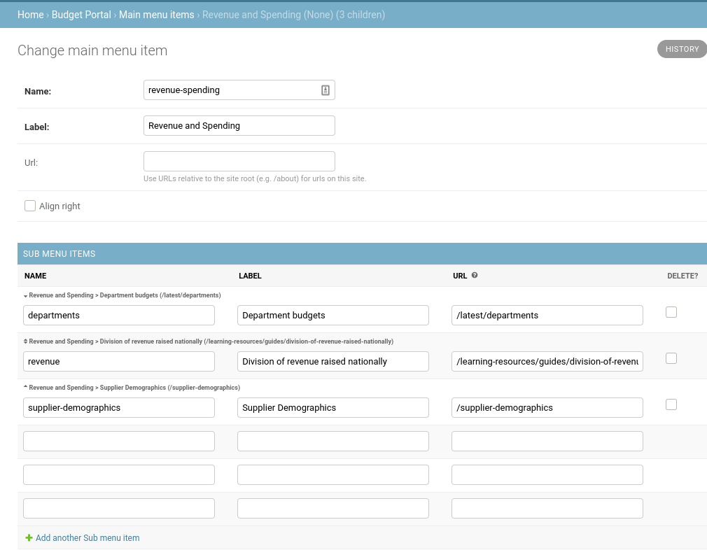
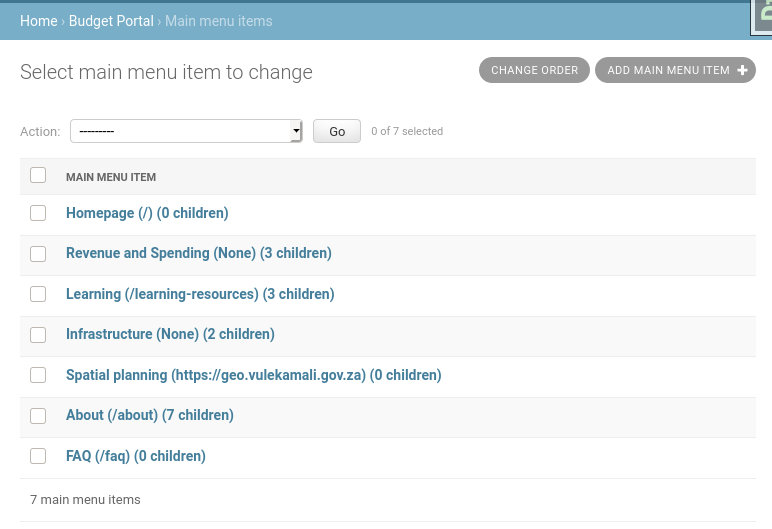

# Editing the menu items

The main and sub-menu items can be modified and re-ordered as needed.

Each main menu item has an optional URL and optional list of sub-menu items

Sub-menu items can be re-ordered under their parent main menu item.

Main menu items can be re-ordered by clicking Change Order on the main menu item list.

