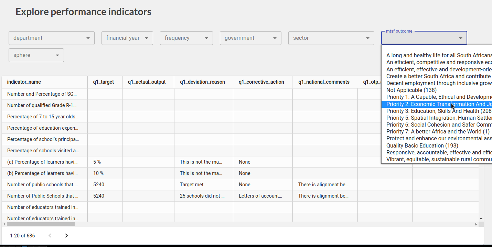
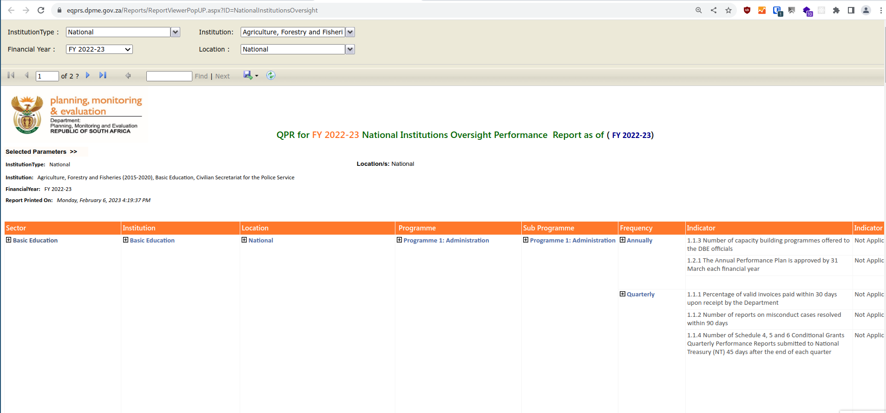
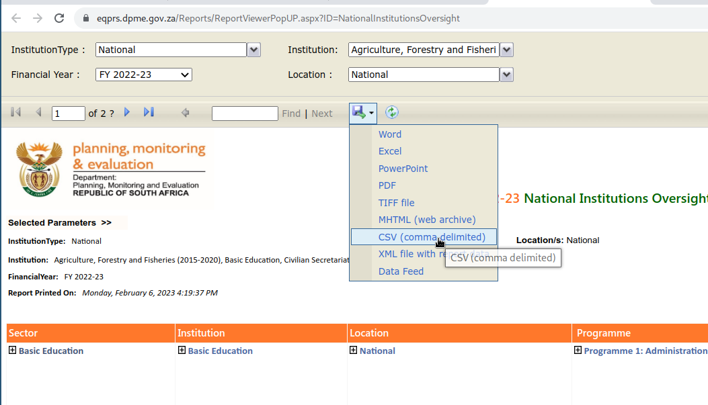
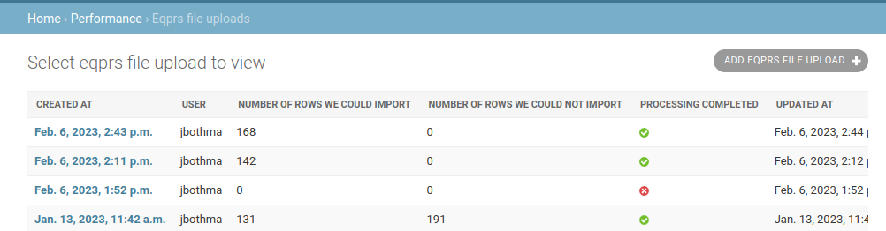
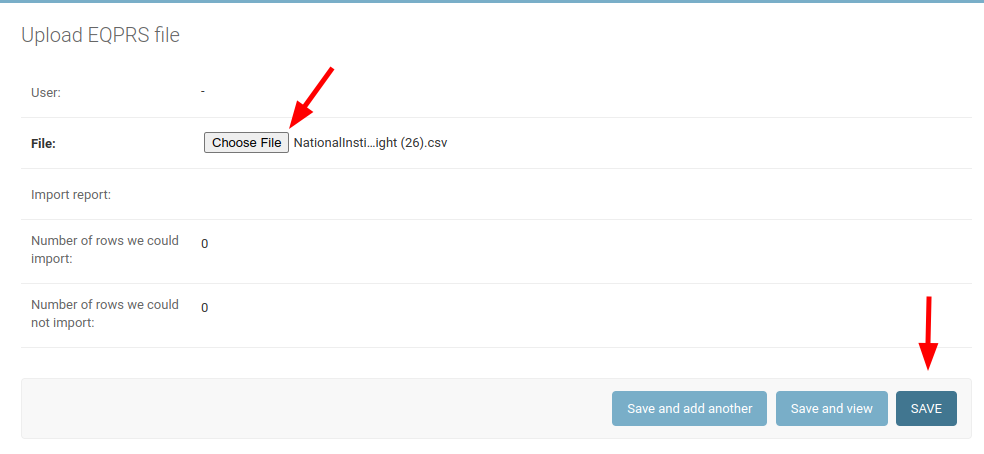
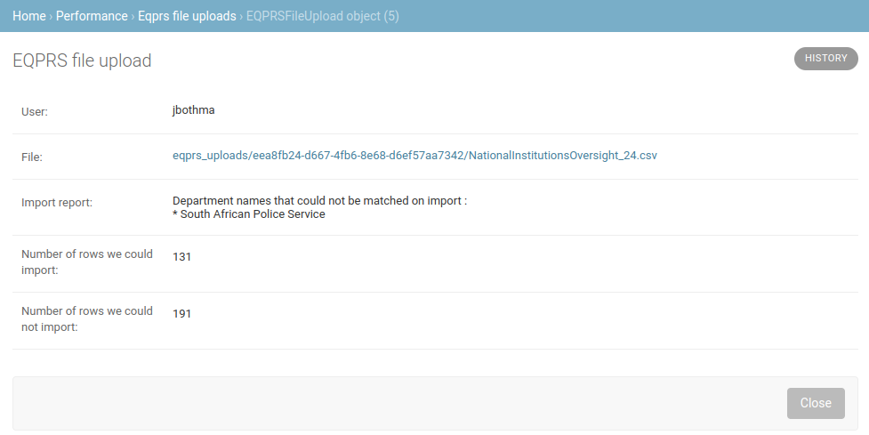
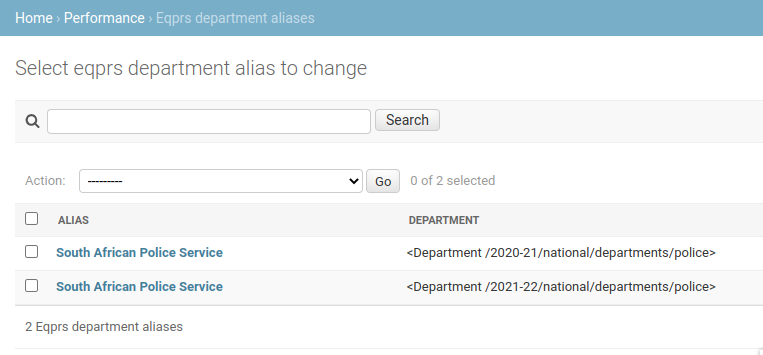
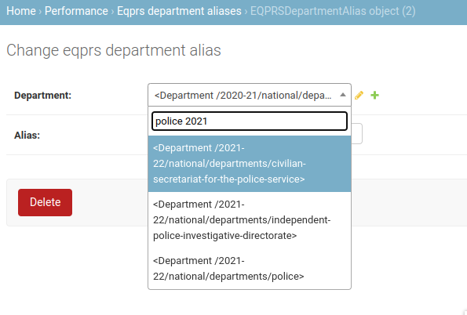

# EQPRS data

The EQPRS data is available on vulekamali as tabular data that can be searched and filtered for relevant indicators. This shows the Quarterly Performance Reporting indicators shown in the Annual Performance Plans, Strategic Plans, ENE and EPRE documents, as well as Annual Reports.

The data looks like this on vulekamali&#x20;

<figure><figcaption></figcaption></figure>

It looks like this in EQPRS:

<figure><figcaption></figcaption></figure>

## Uploading EQPRS data

Uploading EQPRS data to vulekamali involves downloading a few departments at a time, and uploading each file to vulekamali. Vulekamali automatically figures out which financial year, sphere, government and department each indicator belongs to.

Every time you upload data for a given department in a given financial year (in the national or a given provicial government), all the indicators for that department in that year are deleted. This allows the data to be updated without the risk of duplicating indicators.

The video below shows the end-to-end process, and below it are step by step instructions.



### Download data from EQPRS

1. Log in at [https://eqprs.dpme.gov.za/](https://eqprs.dpme.gov.za/) (Request an account if you don't have one yet)
2. Open the report form
   1. For National departments, select **National Institutions Oversight Report**
   2. For provincial departments, select **Provincial Institutions Oversight Report**
3. Select the relevant financial year
4. Select 1-3 departments under Institution


**Select only 1-3 departments at a time**

The EQPRS reports sometimes time out when trying to download to much data at once. When it has timed out, It remains stuck showing the Loading... indicator for over 1 minute.

When this happens, all you can do is reload the page and start again, selecting less data this time.


5. Select the relevant Location
   1. National for national departments
   2. The relevant province for provincial departments
6. Click `View Report` and wait for the data to load
7. When the indicator table has loaded, click the Download menu, and select CSV

<figure><figcaption></figcaption></figure>

### Upload data to vulekamali

1. In the **Performance** > **EQPRS File Uploads** section of the Admin site, click **Add EQPRS file upload**.

<figure><figcaption></figcaption></figure>

2. Select the CSV file that was dowloaded from EQPRS and click Save

<figure><figcaption></figcaption></figure>

After clicking Save, the list of EQPRS file uploads is shown. The Processing completed column shows a question mark (?) for items where processing has not completed yet.

3. Reload the page every few seconds until the question mark changes to a tick or a cross.

A green tick is shown when a file has been completely processed. This does not mean all its data was imported - only that the file was fully processed.&#x20;

A red cross is shown when there was some error and the file could not be fully processed. In this case,&#x20;

* check whether you followed the instructions correctly, and try it again
* check for errors in relevant tasks in the **Django Q** > **Failed Tasks** section in admin and see if the error report helps you to troubleshoot the issue
* contact the developers if you fail to solve it yourself.

4. If a green tick is indicating that the file was fully processed, check if the **Number of rows we could not import column is zero**.&#x20;
5. If it is not zero, open the upload task detail by clicking on the creation date.

<figure><figcaption></figcaption></figure>

6. Check the import report and note that the indicators for the departments listed here were not imported because the names in EQPRS do not match the names in Vuelakamli.


**Do not change the department names in vulekamali to match EQPRS**

Vulekamali reflects official department names as per the appropriation acts of each financial years. Budget and actual spending data should be normalised to match these names. Support for non-matching names in EQPRS may be added to vulekamali in future.


## Dealing with department name mismatches

Department names can differ between Vulekamali and EQPRS.

Some examples of name differences are

* a different name is used, e.g. EQPRS uses `South African Police Service` while Vulekamali uses `Police`
* Some provincial department names include the province in the name, e.g. `Eastern Cape: Human Settlements` while the department is named `Human Settlements` in Vulekamali and won't match.
* There are instances where a financial year or other information is included in the name, e.g. `Human Settlements 2018/19`
* Sometimes there are spelling mistakes or differences in capitalisation or punctuation, e.g. `Sport, arts and culture` vs `Sports, Arts, and Culture`

<figure><figcaption>
Province names as prefixes to department names will be trimmed away automatically
</figcaption></figure>

When importing EQPRS data, Vulekamali will automatically strip the government name (usually the province name) from the department name. e.g. it would treat `Eastern Cape: Human Settlements` as if it was `Human Settlements`.

Any other name mismatches can be handled by creating an alias from the name in EQPRS for the department for a specific financial year. Note that department names may differ from year to year both in Vulekamali and in EQPRS. Pay attention to the import report to see which department name was not found, and requires a mapping.

<figure><figcaption>
An alias should be created for each department that is not matched automatically for each financial year
</figcaption></figure>

You can search for a department name by typing its name and year in the department search box while creating an alias:

<figure><figcaption>
Search for a department using parts of its name and the financial year
</figcaption></figure>
