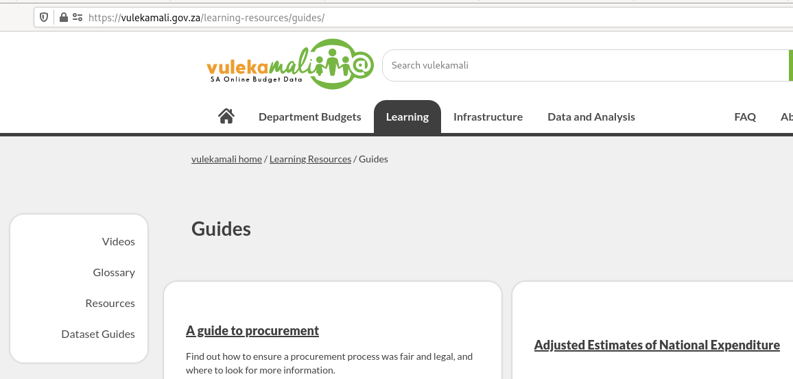
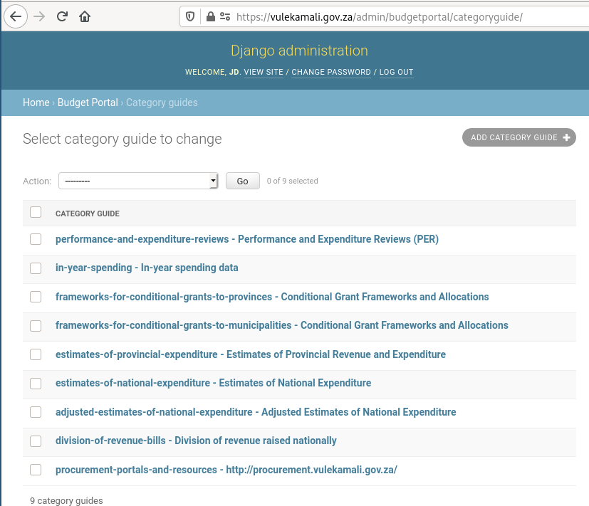
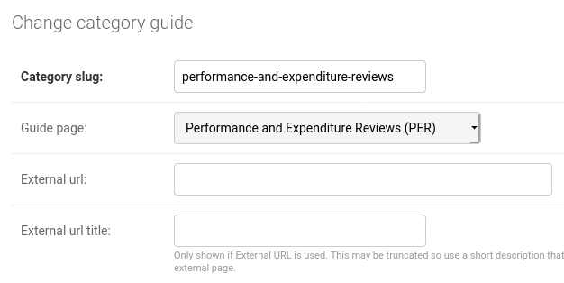
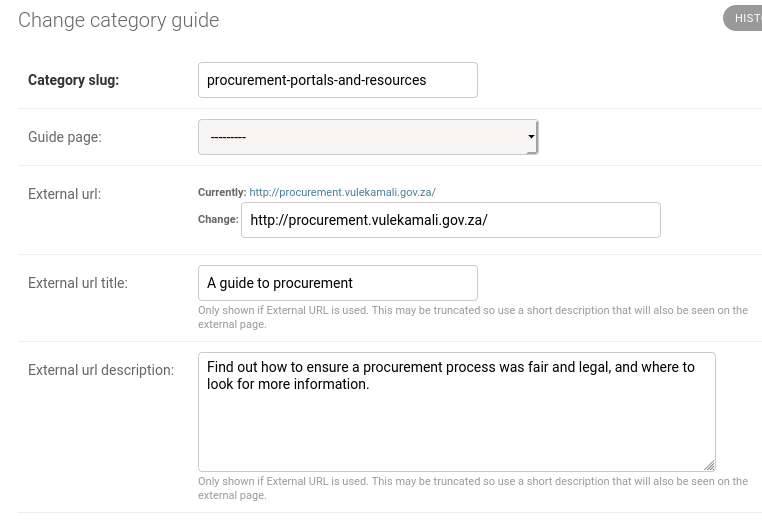

# Linking a dataset category to a guide

We can link data categories to guides so that users looking at the datasets in a category can find relevant documentation for that data.



Vulekamali [data categories](adding-a-new-dataset-category.md) are the top level groups of datasets:

The guides are in the Learning section

A link to a guide looks like the green button at the top of the category, and at the right of a dataset page

Category guides are managed in vulekamali Admin

Enter the category slug.

If the guide is a Guide Page added via the vulekamali Content Management System, select it from the list and click Save.

If the guide is on an external page, enter the URL, title and description in the External URL fields, and click Save.

Adding an external URL as a category guide also causes it to show up in the list of guides in the learning section.

You can link to the same guide from more than one category.

