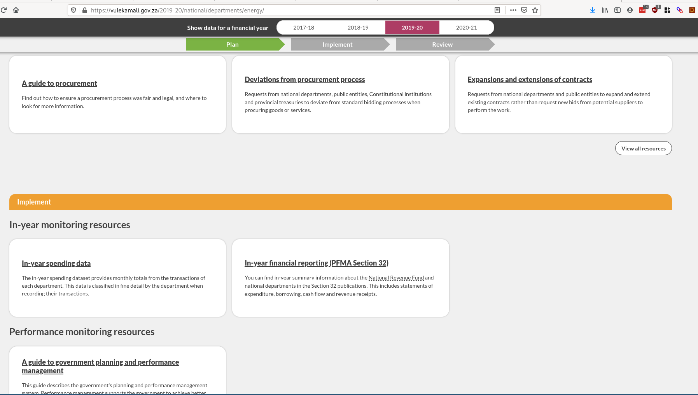
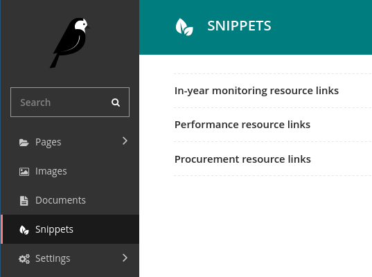
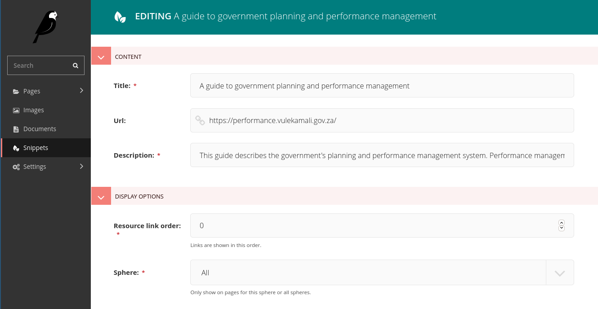
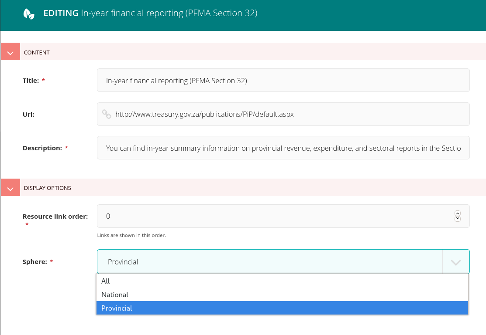

# Linking to resources from Department pages

This page describes how to manage the resource links on department pages. The categories of resource links currently supported are Procurement, Performance, and In-year monitoring.

These links are managed from the CMS.

## Managing department page resource links

Find the resource link categories under Snippets in the CMS

Select one of the links, or create a new one. The editing pane will be shown.

The Sphere drop-down can be used to only show a particular link on departments of that sphere - if only one sphere is relevant to that link:

