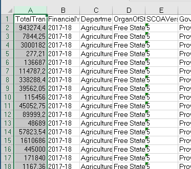

# Updating procurement spend analysis data

## Export the data from the [OCPO Data Warehouse](https://github.com/vulekamali/maintenance/tree/da64355744caa0823b4135c9f0dc6f71eab19e6a/operations-actions/services/ocpo-data-warehouse.md)

Ensure the destination file `OCPO-supplier-spend-data-no-supplier-id.xlsx`does not exist in the destination folder `c:\Vulekamali Export`.

Open the `SQL Server Execute Package Utility`

Select the SQL Server Integration Services \(SSIS\) package in the export folder called `Vulekamali Supplier Demographic Spend analysis Export.dtsx`

Execute the package and check that no errors occurred in the Progress log.

Find the output file `OCPO-supplier-spend-data-no-supplier-id.xlsx` in the destination folder.

## Update the Excel data file

When you open the exported Excel file, the TotalTransAmount will be interpreted as Text by Excel. We need to change it to interpret it as numbers.

Select the TotalTransAmount column

On the Data tab, click Text to Columns

Use the default data type Delimited

We're just using one column so leave Delimiters on just Tab

Use the default format General, and click the Advanced button to the right

Ensure the Decimal separator is `.` not comma to match the separator in the data.

Click finish. When done, the values will be right-aligned because they are now interpreted as numbers by Excel.

## Update the PowerBI Report

Download the latest PowerBI report file from vulekamali.

Open the PowerBI report

Update the data source to the location of the Excel file

Refresh the data from the new Excel file

Publish the file to the info@vulekamali.gov.za PowerBI workspace

Open the file there, and click Publish to web

Click Create embed code

Click Publish

Copy the HTML code to paste into vulekamali

Find the HTML embed code in the Procurement Spend Analysis page editor in the vulekamali Content Management System.

Replace the old embed code with the new one.

Replace `width="800" height="600"` with `width="100%" style="height: 75vh"`

Save the page, and check that it is showing the updated data.

