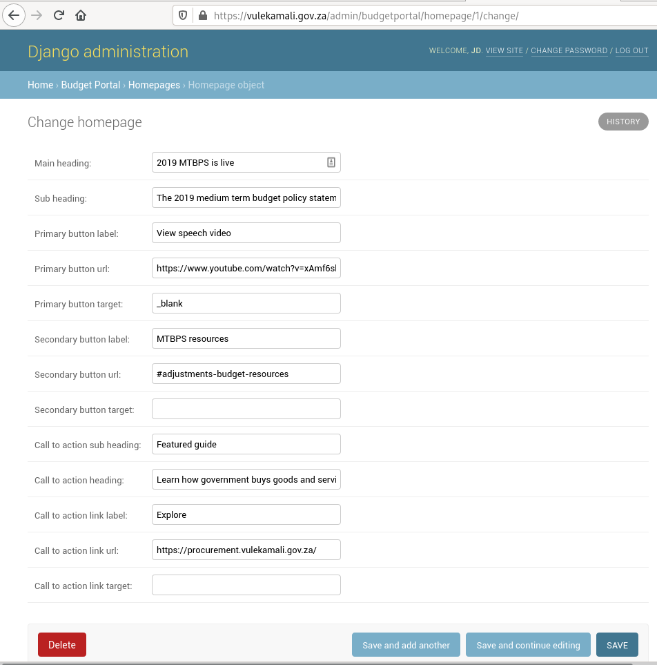
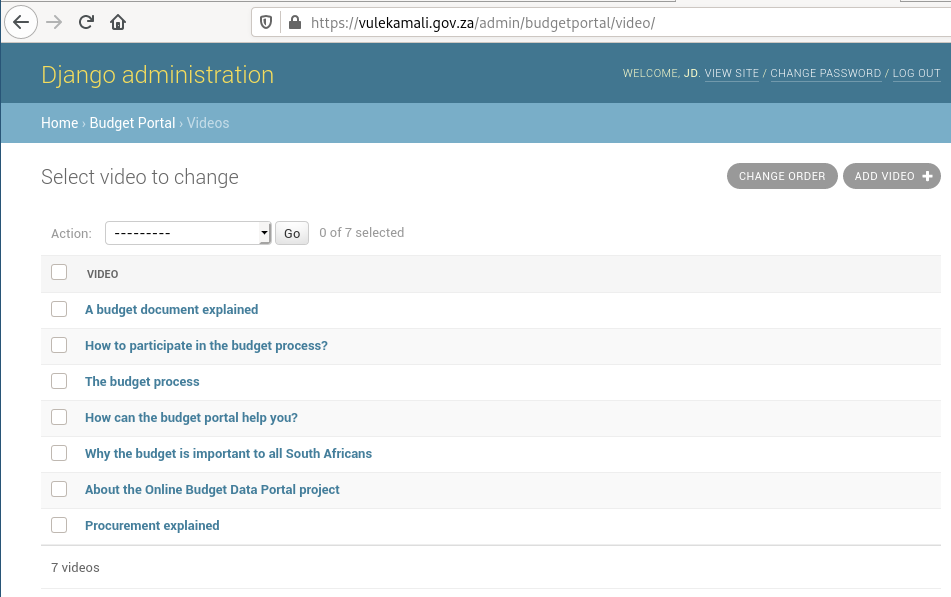
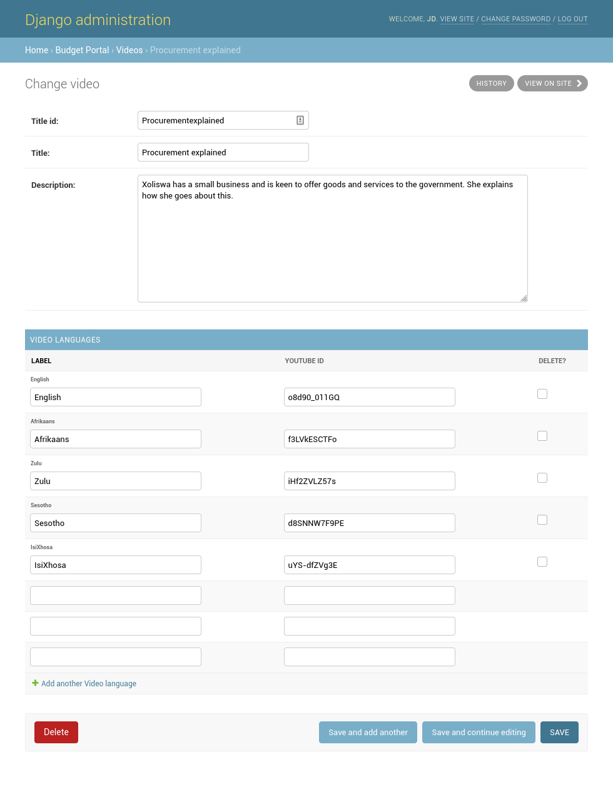
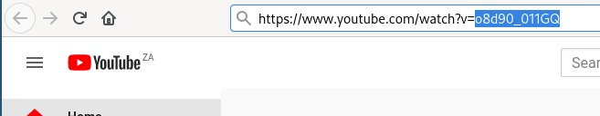
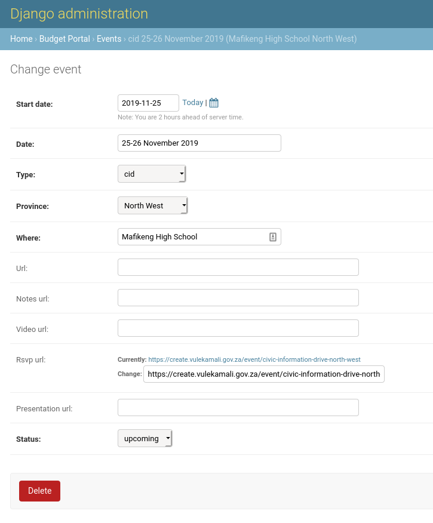

# Updating content pages

## Homepage

The homepage is used to feature specific things when they are particularly relevant or new.

## Videos

The videos are listed on the videos page. To change the order of the videos list, click the Change Order button on the top right of the video admin list, reorder the items, and save.

The videos featured on the homepage are hardcoded based on their id.

See previous examples for how to fill in the details of new videos.

Each video has one or more languages. Each language has its own video ID.

The video ID is the ID youtube gave the video when uploading. It can be found in the youtube account managed by Treasury Comms, or in the video URL.

## Events

Events are managed on the events page in Admin. Use the Status field to place them in Upcoming or Past.

