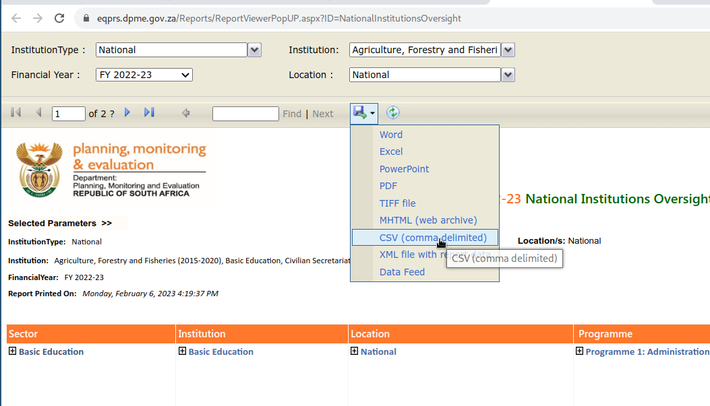

# Uploading EQPRS data

Uploading EQPRS data to vulekamali involves downloading a few departments at a time, and uploading each file to vulekamali. Vulekamali automatically figures out which financial year, sphere, government and department each indicator belongs to.

Every time you upload data for a given department in a given financial year (in the national or a given provicial government), all the indicators for that department in that year are deleted. This allows the data to be updated without the risk of duplicating indicators.

The video below shows the end-to-end process, and below it are step by step instructions.



### Download data from EQPRS

1. Log in at [https://eqprs.dpme.gov.za/](https://eqprs.dpme.gov.za/) (Request an account if you don't have one yet)
2. Open the report form
   1. For National departments, select **National Institutions Oversight Report**
   2. For provincial departments, select **Provincial Institutions Oversight Report**
3. Select the relevant financial year
4. Select 1-3 departments under Institution


**Select only 1-3 departments at a time**

The EQPRS reports sometimes time out when trying to download to much data at once. When it has timed out, It remains stuck showing the Loading... indicator for over 1 minute.

When this happens, all you can do is reload the page and start again, selecting less data this time.


5. Select the relevant Location
   1. National for national departments
   2. The relevant province for provincial departments
6. Click `View Report` and wait for the data to load
7. When the indicator table has loaded, click the Download menu, and select CSV

<figure><figcaption></figcaption></figure>

### Upload data to vulekamali
