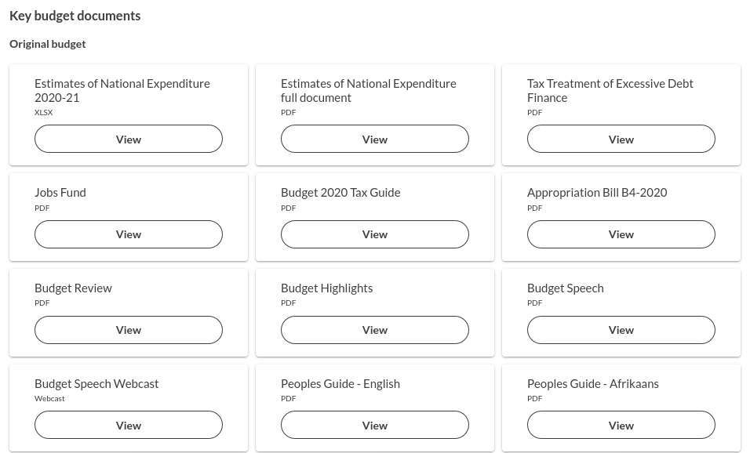
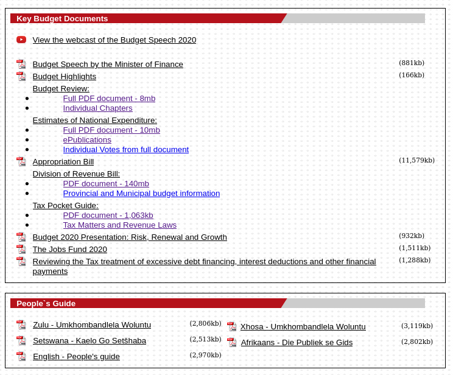

# Uploading key budget documents

The key budget documents are shown on the [departments list page](https://vulekamali.gov.za/2020-21/departments) for a given financial year.

We upload the documents to datasets in CKAN because it allows the consistent documents to be categorised consistently, making it easy to find them alongside relevant data, and if someone is looking for all instances of the same document.

In the examples below, 

* if the financial year is 2020-21, treat `<financial year>` as `2020-21`
* for a provncial document, if the province is Limpopo, treat `<province>` as `Limpopo`
* etc

For each document, if the dataset title is the same, then the document should be uploaded as a different resource on the same dataset.

Always specify the the financial year in the Financial year field.

## National budget documents

Always specify the sphere as National, with no provinces selected.

The key national budget documents are those on the year's budget page on treasury.gov.za

### Original budget

<table>
  <thead>
    <tr>
      <th style="text-align:left">Document</th>
      <th style="text-align:left">Dataset title</th>
      <th style="text-align:left">Resource title</th>
      <th style="text-align:left">Type</th>
      <th style="text-align:left">Group</th>
    </tr>
  </thead>
  <tbody>
    <tr>
      <td style="text-align:left">Budget Speech video</td>
      <td style="text-align:left">National Budget Speech &lt;financial year&gt;</td>
      <td style="text-align:left">Budget Speech Webcast</td>
      <td style="text-align:left">Webcast</td>
      <td style="text-align:left">Budget Speeches</td>
    </tr>
    <tr>
      <td style="text-align:left">Budget Speech document</td>
      <td style="text-align:left">National Budget Speech &lt;financial year&gt;</td>
      <td style="text-align:left">Budget Speech</td>
      <td style="text-align:left"></td>
      <td style="text-align:left">Budget Speeches</td>
    </tr>
    <tr>
      <td style="text-align:left">Estimates of National Expenditure</td>
      <td style="text-align:left">Estimates of National Expenditure &lt;financial year&gt; <em>(same dataset as for the structured data)</em>
      </td>
      <td style="text-align:left">Estimates of National Expenditure full document</td>
      <td style="text-align:left"></td>
      <td style="text-align:left">Estimates of National Expenditure</td>
    </tr>
    <tr>
      <td style="text-align:left">Budget highlights</td>
      <td style="text-align:left">National Budget Highlights &lt;financial year&gt;</td>
      <td style="text-align:left">Budget Highlights</td>
      <td style="text-align:left"></td>
      <td style="text-align:left">Budget Highlights</td>
    </tr>
    <tr>
      <td style="text-align:left">People&apos;s guides</td>
      <td style="text-align:left">National Budget People&apos;s Guide</td>
      <td style="text-align:left">People&apos;s Guide - &lt;language&gt;</td>
      <td style="text-align:left"></td>
      <td style="text-align:left">People&apos;s Guides</td>
    </tr>
    <tr>
      <td style="text-align:left">Budget Highlights</td>
      <td style="text-align:left">National Budget Highlights &lt;financial year&gt;</td>
      <td style="text-align:left">Budget Highlights</td>
      <td style="text-align:left"></td>
      <td style="text-align:left">Budget Highlights</td>
    </tr>
    <tr>
      <td style="text-align:left">Budget Review</td>
      <td style="text-align:left">National Budget Review &lt;financial year&gt;</td>
      <td style="text-align:left">Budget Review</td>
      <td style="text-align:left"></td>
      <td style="text-align:left">Budget Reviews</td>
    </tr>
    <tr>
      <td style="text-align:left">Appropriation bill</td>
      <td style="text-align:left">National Appropriation Bill &lt;financial year&gt;</td>
      <td style="text-align:left">
        
Appropriation Bill

        
<em>(if the bill reference like B2-2020 is available, it&apos;s ok to include that)</em>
        

      </td>
      <td style="text-align:left"></td>
      <td style="text-align:left">Appropriation Bills</td>
    </tr>
    <tr>
      <td style="text-align:left">Division of Revenue bill</td>
      <td style="text-align:left">Division of Revenue Bill</td>
      <td style="text-align:left">Division of Revenue Bill</td>
      <td style="text-align:left"></td>
      <td style="text-align:left">Division of Revenue Bills</td>
    </tr>
    <tr>
      <td style="text-align:left">Tax pocket guide</td>
      <td style="text-align:left">Tax Pocket Guide &lt;financial year&gt;</td>
      <td style="text-align:left">Budget &lt;year&gt; Tax Guide<em> (if the title it has on the page makes more sense, us that.</em>
      </td>
      <td style="text-align:left"></td>
      <td style="text-align:left">Tax Pocket Guides</td>
    </tr>
    <tr>
      <td style="text-align:left"><em>Any additional documents listed as key documents, which don&apos;t occur each year.</em>
      </td>
      <td style="text-align:left">See classification guide</td>
      <td style="text-align:left"></td>
      <td style="text-align:left"></td>
      <td style="text-align:left">Occasional Budget Documents</td>
    </tr>
  </tbody>
</table>

### Adjusted Budget

## Provincial

### Original Budget

### Adjusted Budget

