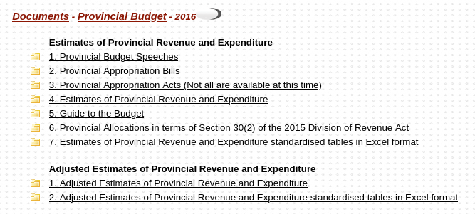

# Uploading key budget documents

The key budget documents are shown on the [departments list page](https://vulekamali.gov.za/2020-21/departments) for a given financial year.

We upload the documents to datasets in CKAN because it allows the regular documents to be categorised consistently, making it easy to find them alongside relevant data, and if someone is looking for all instances of the same document. It is then also possible to provide some guidance for how to use specific kinds of documents.

In the examples below, 

* if the financial year is 2020-21, treat `<financial year>` as `2020-21`
* for a provincial document, if the province is Limpopo, treat `<province>` as `Limpopo`
* etc

For each document, if the dataset title is the same, then the document should be uploaded as a different resource on the same dataset.

Always specify the the financial year in the Financial year field.

## National budget documents

Always specify the sphere as National, with no provinces selected.

The key national budget documents are those on the year's budget page on treasury.gov.za

### Original budget

<table>
  <thead>
    <tr>
      <th style="text-align:left">Document</th>
      <th style="text-align:left">Dataset title</th>
      <th style="text-align:left">Resource title</th>
      <th style="text-align:left">Type</th>
      <th style="text-align:left">Group</th>
    </tr>
  </thead>
  <tbody>
    <tr>
      <td style="text-align:left">Budget Speech video</td>
      <td style="text-align:left">National Budget Speech &lt;financial year&gt;</td>
      <td style="text-align:left">Budget Speech Webcast</td>
      <td style="text-align:left">Webcast</td>
      <td style="text-align:left">Budget Speeches</td>
    </tr>
    <tr>
      <td style="text-align:left">Budget Speech document</td>
      <td style="text-align:left">National Budget Speech &lt;financial year&gt;</td>
      <td style="text-align:left">Budget Speech</td>
      <td style="text-align:left"></td>
      <td style="text-align:left">Budget Speeches</td>
    </tr>
    <tr>
      <td style="text-align:left">Estimates of National Expenditure</td>
      <td style="text-align:left">Estimates of National Expenditure &lt;financial year&gt; <em>(same dataset as for the structured data)</em>
      </td>
      <td style="text-align:left">Estimates of National Expenditure full document</td>
      <td style="text-align:left"></td>
      <td style="text-align:left">Estimates of National Expenditure</td>
    </tr>
    <tr>
      <td style="text-align:left">Budget highlights</td>
      <td style="text-align:left">National Budget Highlights &lt;financial year&gt;</td>
      <td style="text-align:left">Budget Highlights</td>
      <td style="text-align:left"></td>
      <td style="text-align:left">Budget Highlights</td>
    </tr>
    <tr>
      <td style="text-align:left">People&apos;s guides</td>
      <td style="text-align:left">National Budget People&apos;s Guide</td>
      <td style="text-align:left">People&apos;s Guide - &lt;language&gt;</td>
      <td style="text-align:left"></td>
      <td style="text-align:left">People&apos;s Guides</td>
    </tr>
    <tr>
      <td style="text-align:left">Budget Review</td>
      <td style="text-align:left">National Budget Review &lt;financial year&gt;</td>
      <td style="text-align:left">Budget Review</td>
      <td style="text-align:left"></td>
      <td style="text-align:left">Budget Reviews</td>
    </tr>
    <tr>
      <td style="text-align:left">Appropriation bill</td>
      <td style="text-align:left">National Appropriation Bill &lt;financial year&gt;</td>
      <td style="text-align:left">
        
Appropriation Bill

        
<em>(if the bill reference like B2-2020 is available, it&apos;s ok to include that)</em>
        

      </td>
      <td style="text-align:left"></td>
      <td style="text-align:left">Appropriation Bills</td>
    </tr>
    <tr>
      <td style="text-align:left">Division of Revenue bill (see <a href="adding-a-new-division-of-revenue-bill.md">full details</a>)</td>
      <td
      style="text-align:left">Division of Revenue Bill</td>
        <td style="text-align:left">Division of Revenue Bill</td>
        <td style="text-align:left"></td>
        <td style="text-align:left">Division of Revenue Bills</td>
    </tr>
    <tr>
      <td style="text-align:left">Tax pocket guide</td>
      <td style="text-align:left">Tax Pocket Guide &lt;financial year&gt;</td>
      <td style="text-align:left">Budget &lt;year&gt; Tax Guide<em> (if the title it has on the page makes more sense, us that.</em>
      </td>
      <td style="text-align:left"></td>
      <td style="text-align:left">Tax Pocket Guides</td>
    </tr>
    <tr>
      <td style="text-align:left"><em>Any additional documents listed as key documents, which don&apos;t occur each year.</em>
      </td>
      <td style="text-align:left"><a href="../../design/classifying-public-finance-data-documents-ckan.md">See classification guide</a>
      </td>
      <td style="text-align:left"></td>
      <td style="text-align:left"></td>
      <td style="text-align:left">Occasional Budget Documents</td>
    </tr>
  </tbody>
</table>

### Adjusted Budget

|  | Dataset title | Resource title | Type | Group |
| :--- | :--- | :--- | :--- | :--- |
| Medium Term Budget Policy Statement | Medium Term Budget Policy Statement &lt;financial year&gt; | Medium Term Budget Policy Statement |  | Medium Term Budget Policy Statement |
| MTBPS speech document | MTBPS Speech &lt;financial year&gt; | MTBPS Speech |  | Medium Term Budget Policy Statement Speeches |
| MTBPS Speech webcast | MTBPS Speech &lt;financial year&gt; | MTBPS Speech | Webcast | Medium Term Budget Policy Statement Speeches |
| Adjusted Estimates of National Expenditure | Adjusted Estimates of National Expenditure &lt;financial year&gt; | Adjusted Estimates of National Expenditure |  | Adjusted Estimates of National Expenditure |
| Division of Revenue Amendment Act | Division of Revenue Amendment Bill &lt;financial year&gt; | Division of Revenue Amendment Act |  | Division of Revenue Amendment Bills |
| Division of Revenue Amendment Bill | Division of Revenue Amendment Bill &lt;financial year&gt; | Division of Revenue Amendment Bill |  | Division of Revenue Amendment Bills |
| Adjustments Appropriation Bill | National Adjustments Appropriation Bill &lt;financial year&gt; | Adjustments Appropriation Bill |  | Adjustments Appropriation Bill |
| Rates and Monetary Amounts and Amendment of Revenue Laws Bill | Rates and Monetary Amounts and Amendment of Revenue Laws Bill &lt;financial year&gt; | Rates and Monetary Amounts and Amendment of Revenue Laws Bill |  | Rates and Monetary Amounts and Amendment of Revenue Laws Bill |
| Tax Administration Laws Amendment Bill | Tax Administration Laws Amendment Bill &lt;financial year&gt; | Tax Administration Laws Amendment Bill |  | Tax Administration Laws Amendment Bill |
| Taxation Laws Amendment Bill | Taxation Laws Amendment Bill &lt;financial year&gt; | Tax Administration Laws Amendment Bill |  | Taxation Laws Amendment Bill |

## Provincial budget documents

The documents for each province are under directories for that document type

### Original Budget

| Document | Dataset title | Resource title | Group |  |
| :--- | :--- | :--- | :--- | :--- |
| Budget Speech | &lt;province&gt; Budget Speech &lt;financial year&gt; | Budget Speech | Budget Speeches |  |
| Appropriation Bill | &lt;province&gt; Appropriation Bill &lt;financial year&gt; | Appropriation Bill |  |  |
| Appropriation Act | &lt;province Appropriation Bill &lt;financial year&gt; | Appropriation Act |  |  |
| Estimates of Provincial Revenue and Expenditure | &lt;province&gt; Estimates of Provincial Revenue and Expenditure &lt;financial year&gt; | Estimates of Provincial Revenue and Expenditure |  |  |
| Guide to the budget | &lt;province&gt; &lt;their title&gt; &lt;financial year&gt; _e.g. Gauteng Socio-Economic Review and Outlook 2016-17 or Limpopo People's Guide to the Budget 2019-20_ | &lt;their title&gt; |  |  |
| Provincial allocations to schools and municipalities _\(_ [_in terms of Section 30\(2\) of the 2015 Division of Revenue Act_](http://www.treasury.gov.za/documents/provincial%20budget/2016/6.%20Prov%20Allocation%20ito%20S30%282%29%20of%20DoRA/Default.aspx)_\)_ | &lt;province&gt; Provincial allocations in terms of Section 30\(2\) of the &lt;year&gt; Division of Revenue Act | Provincial allocations in terms of Section 30\(2\) of the 2015 Division of Revenue Act |  |  |
| Estimates of Provincial Revenue and Expenditure standardised tables in Excel format | &lt;province&gt; Estimates of Provincial Revenue and Expenditure &lt;financial year&gt;  |  |  |  |
| _Any additional documents listed as key documents, which don't occur each year._ | See classification guide |  |  | Occasional Budget Documents |

### Adjusted Budget

| Document | Dataset title | Resource title | Group |
| :--- | :--- | :--- | :--- |
| Adjusted Estimates of Provincial Revenue and Expenditure |  |  |  |
| Adjusted Estimates of Provincial Revenue and Expenditure standardised tables in Excel format |  |  |  |

