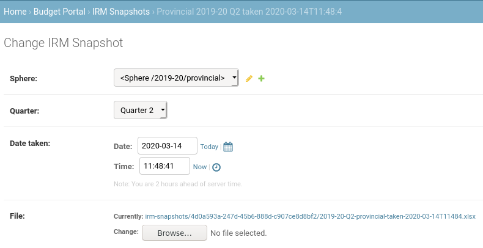
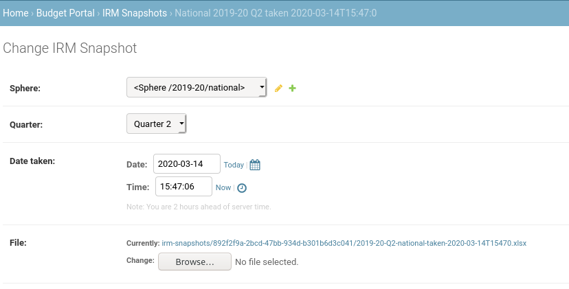
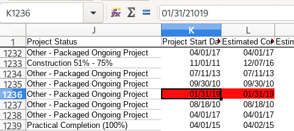

# Uploading \(IRM\) infrastructure project data

Infrastructure projects are represented by a unique ID used by vulekamali, and the ID of the project in the Infrastructure Reporting Model \(IRM\) database. 

Provincial IRM data was added in January 2020.

National IRM support was added in March 2020 and the data is to be added once the quality is sufficient.

We keep snapshots of each project at different times in its life in the IRM database to reflect updates over time. These are called **Project Snapshots**.

We upload snapshots of the IRM database each quarter. These are called **IRM Snapshots**.

## Adding an IRM snapshot

Select the sphere from the financial year that the data relates to.

Select the Provincial sphere for privincial data

Select the National sphere for national data

## Troubleshooting/FAQ

### BadZipfile: File is not a zip file

Make sure you uploaded a `.xlsx` file. xlsx files are really zip files with Excel data in them.

### ValueError: year is out of range \(datetime.datetime\(\*parts\[:3\]\) + diff \)

We've gotten this when there were extra digits in the year part of date columns - e.g. see this screenshot:

We've deleted these rows by adding conditional formatting to highlight the odd dates, then deleting those rows. This is error-prone and time-consuming so it would be better to restrict the input of dates to realistic years.

## Data format

National and Provincial data must follow the same format, detailed below:

The file must be an xlsx file. Not the "xls" file which is really "Tab Separated Variables" \(TSV\) as exported directly from IRM.

Precisely these columns must be used, in this order. No additional columns may be included. This is to ensure that only the data that is approved for release can be released to the public.

The data for "Program Implementing Agent", "Principal Agent", "Main Contractor" must be in one or more columns labeled "Project Contractor", prefixed with the intended column heading, and a colon. e.g. `Program Implementing Agent: Human Settlements`. It will then be mapped to that field. Multiple values with the same prefixed will be shown one per line in the same field. Anything without that prefix will end up in `Other parties`.





