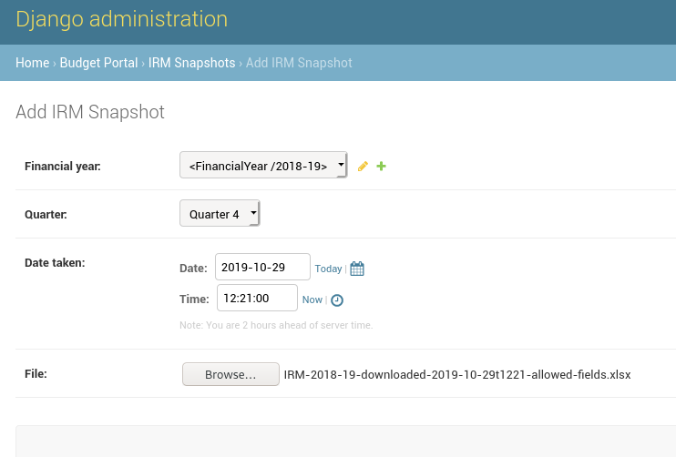

# Uploading provincial infrastructure project data

Provincial infrastructure projects are represented by a unique ID used by vulekamali, and the ID of the project in the Infrastructure Reporting Model \(IRM\) database. These are referred to as **Provincial Infrastructure Projects**.

We keep snapshots of each project at different times in its life in the IRM database to reflect updates over time. These are called **Project Snapshots**.

We upload snapshots of the IRM database each quarter. These are called **IRM Snapshots**.

## Adding an IRM snapshot

## Troubleshooting/FAQ

### BadZipfile: File is not a zip file

Make sure you uploaded a `.xlsx` file. xlsx files are really zip files with Excel data in them.

### ValueError: year is out of range \(datetime.datetime\(\*parts\[:3\]\) + diff \)

We've gotten this when there were extra digits in the year part of date columns - e.g. see this screenshot:

We've deleted these rows by adding conditional formatting to highlight the odd dates, then deleting those rows. This is error-prone and time-consuming so it would be better to restrict the input of dates to realistic years.

