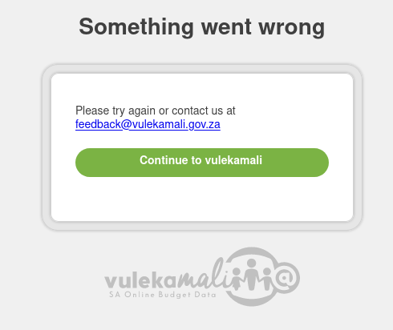
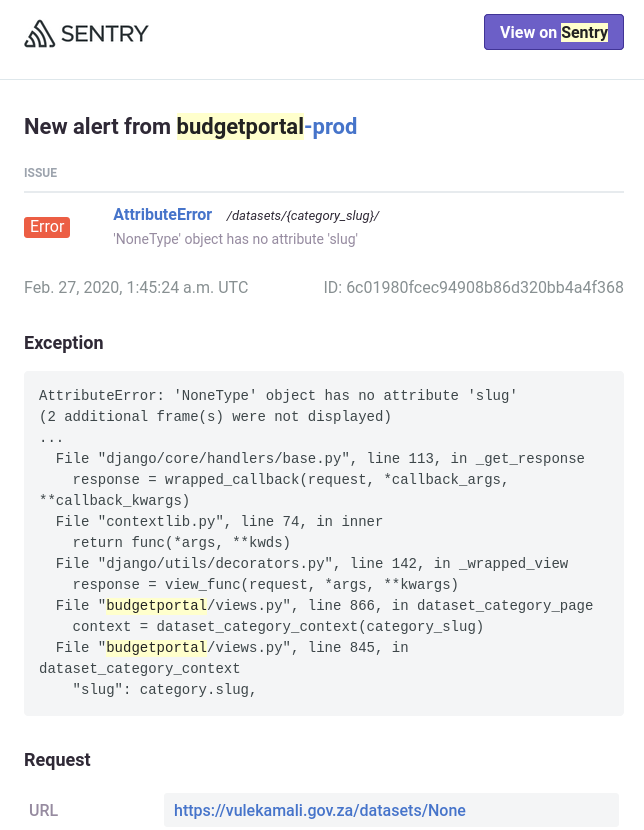

# Troubleshooting

## "Something went wrong" message

If you get the error message "Something went wrong", this means an unexpected error happened, and the system does not know how to provide a more detailed error message.

### Why does this happen?

This happens because there are many thousands of different things that can go wrong, and it's impossible to predict all of them, and give helpful instructions for resolving the issue.

The more specific features like department-specific charts and charts that handle specific values in special ways are quite intricate and can break in unexpected ways if some of the assumptions are not met.

### What to do next

1. Review the instructions for the operation you are trying to do very carefully - they must be followed very precisely.
2. Go over each step and make sure it was carried out correctly
3. Compare to previous years or versions of the same thing

If you still can't solve it, contact the hosters - they will receive technical details of the error when it happens, and might be able to help understand what went wrong.

1. Send an email with a screenshot of the error
2. Make sure to include the Address Bar of your browser in the screenshot so they can see where you encountered the error. \(See the example below\)
3. Include a link to the documentation you were following and which step you were on
4. Include what you expected to see when the error occurred

### What if the same issue comes up frequently

If the same problem comes up frequently, developers can build in a feature to make it easier for operators/administrators to identify and resolve the problem themselves.

Send a request to the developers with the details above - they can then estimate the effort involved in making self-service of that issue easier for administrators, and help the Project Lead prioritise the work.

