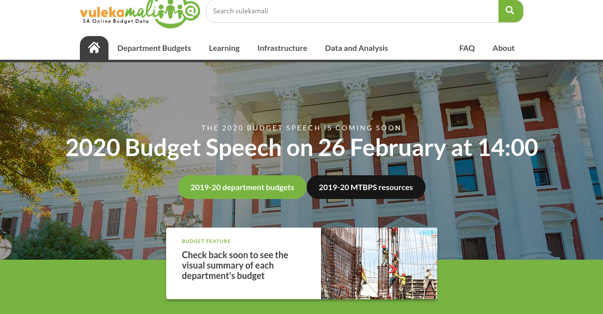
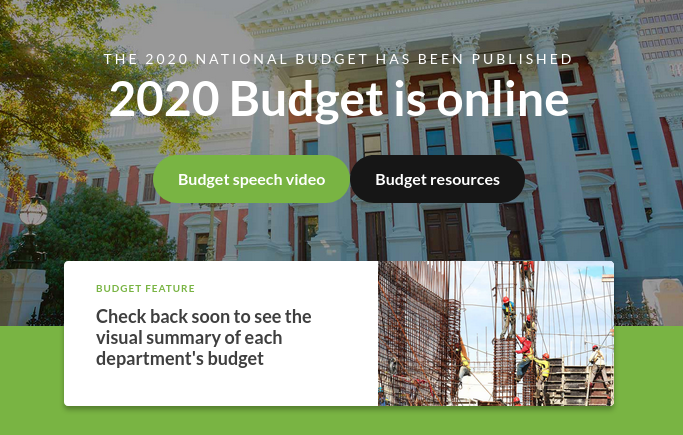
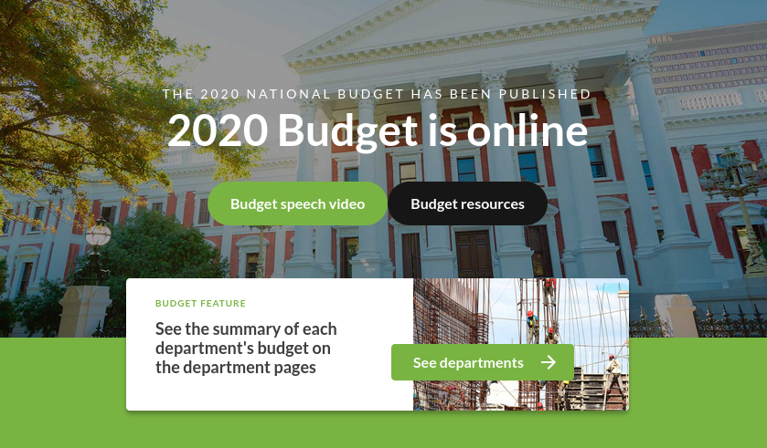

# Update the homepage state

### Before the budget speech

Link to the video when the live stream link is available - until then, link to the MTBPS resources

Link to the departmebt budgets for the current financial year.

### When the budget speech starts

Link to the speech video and the resources page for the new budget on www.treasury.gov.za

### Once the structured data is loaded 

When the data is loaded and the new financial year's data is presented in charts, update the homepage to link to the departments using the featured card.

