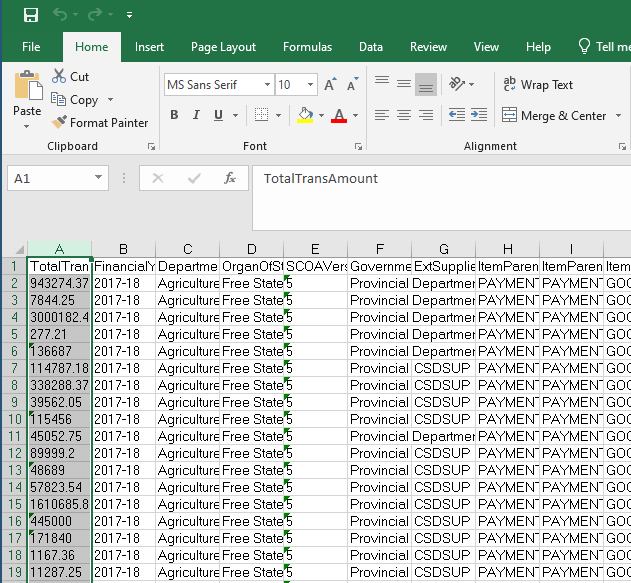
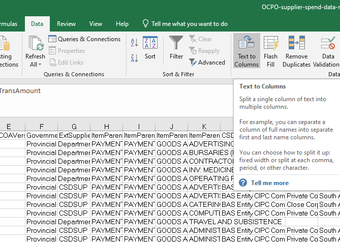
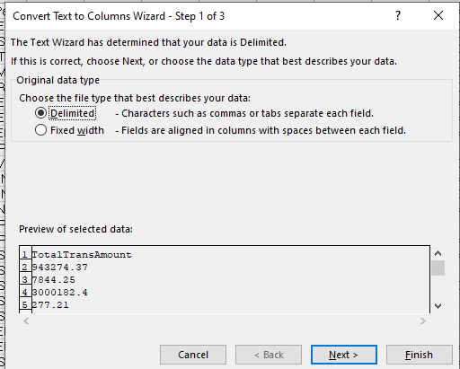
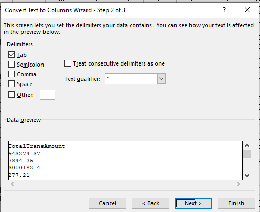
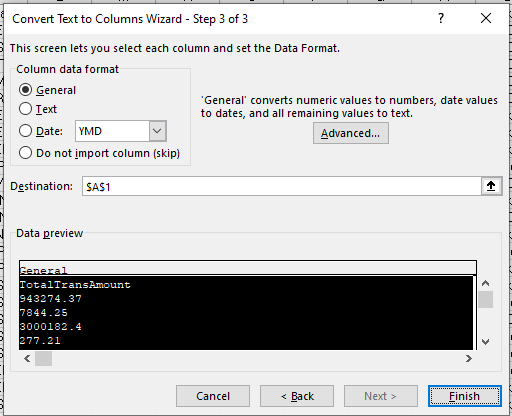
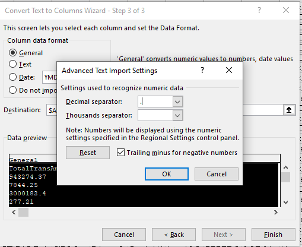
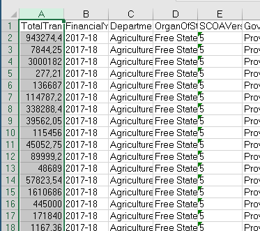

# Annual procurement data updates

When you open the exported Excel file, the TotalTransAmount will be interpreted as Text by Excel. We need to change it to interpret it as numbers.

Select the TotalTransAmount column

On the Data tab, click Text to Columns

Use the default data type Delimited

We're just using one column so leave Delimiters on just Tab

Use the default format General, and click the Advanced button to the right

Ensure the Decimal separator is `.` not comma to match the separator in the data.

Click finish. When done, the values will be right-aligned because they are now interpreted as numbers by Excel.

