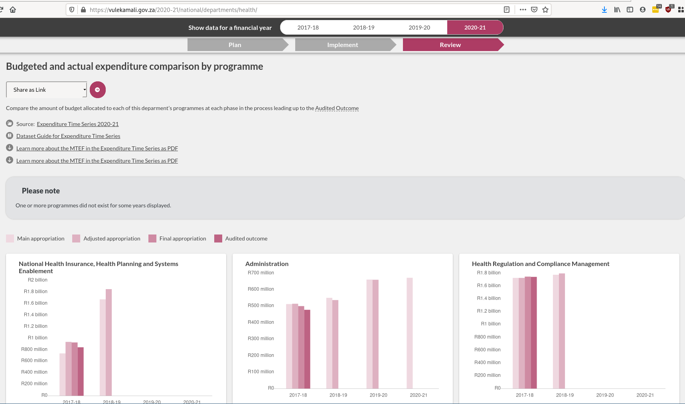

# September: Audit Outcomes

## Steps

1. [Prepare and upload annual audit outcomes dataset](../operations-actions/adding-modifying-information-on-the-site/adding-structured-fiscal-data-to-openspending/#national-annual-report-expenditure)
   1. [Examples](https://vulekamali.gov.za/datasets/annual-reports)
2. [Update and upload National Budget vs Actual dataset](../operations-actions/adding-modifying-information-on-the-site/adding-structured-fiscal-data-to-openspending/#budgeted-and-actual-national-expenditure)
   1. [Examples](https://vulekamali.gov.za/datasets/budgeted-and-actual-national-expenditure)

## Roles

* ETL developer
* Metadata editor

## Data requirements

* National audited actuals

