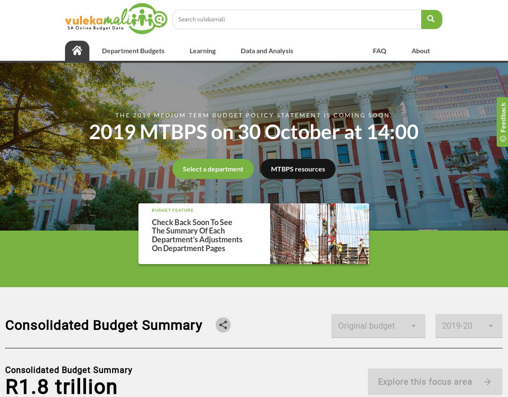
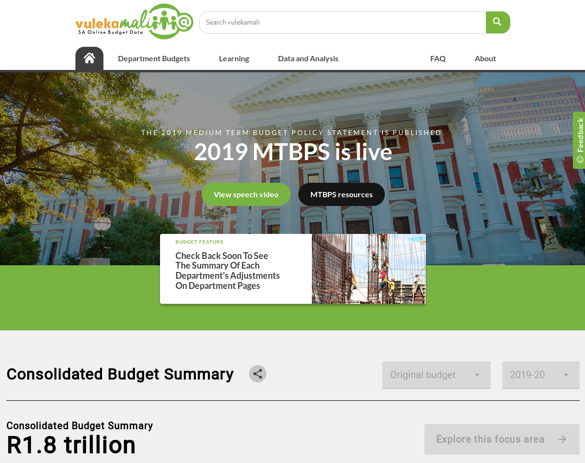
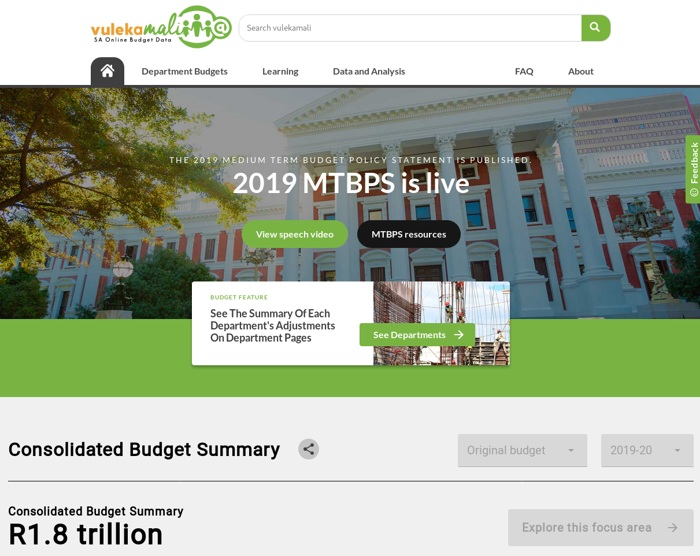

# Update the homepage state

### A few days before the speech

Before the MTBPS we link to the department pages and past MTBPS resources

### During the speech

We link to the MTBPS resources on [https://www.treasury.gov.za](https://www.treasury.gov.za) and link to the speech live stream

### When the Adjustment Budget data is fully loaded

When the structured data and MTBPS resources are fully loaded, we use the featured card to link to that, and also link to the speech video and documents.

