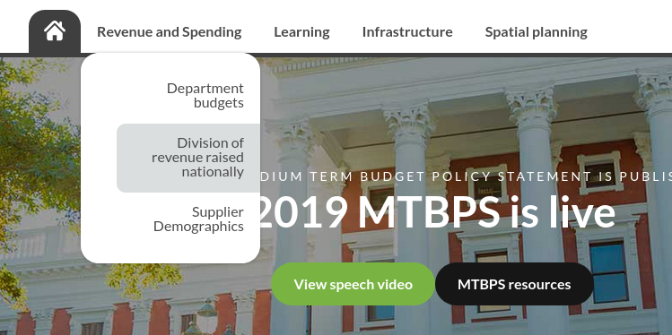

# Phase 4 draft features

## Spatial planning and facilities

1. Publish the [Spatial Planning guide](https://vulekamali.gov.za/cms/pages/13/edit/) once you have finalised it.
2. Delete this section

## Procurement data

1. Validate the vulekamali supplier demographics spend analysis dataset
2. Upload the dataset to a [new category](../operations-actions/adding-modifying-information-on-the-site/adding-a-new-dataset-category.md)
3. [Link the new category to the Procurement Guide subsite](../operations-actions/adding-modifying-information-on-the-site/linking-a-dataset-category-to-a-guide.md)
4. Update the link to the new dataset category in the [Supplier Demographics Spend Analysis](https://vulekamali.gov.za/cms/pages/14/edit/) page
5. Publish the [Supplier Demographics Spend Analysis page](https://vulekamali.gov.za/cms/pages/14/edit/) once you have finalised it
6. Delete this section

## Performance data

1. Create a new [Data Category](../operations-actions/adding-modifying-information-on-the-site/adding-a-new-dataset-category.md)
2. [Link the new category to the Quarterly Performance Reporting section on the Performance Guide subsite](../operations-actions/adding-modifying-information-on-the-site/linking-a-dataset-category-to-a-guide.md)
3. Upload the EQPRS exports there
4. Delete this section

## New menu items

We recommend the following [arrangement of the main menu ](../operations-actions/adding-modifying-information-on-the-site/editing-the-menu-items.md)to provide easy access to the new features

* Add Supplier Demographics to the Revenue and Spending menu
* Add Spatial planning as a Main menu item.

## Delete this page

1. When all the new features have been published, delete this page.

