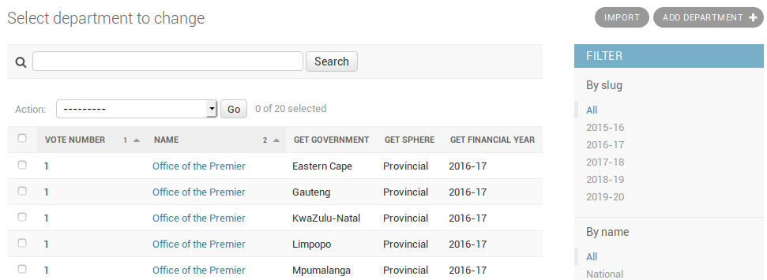
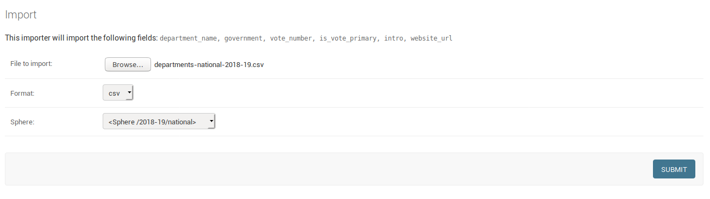
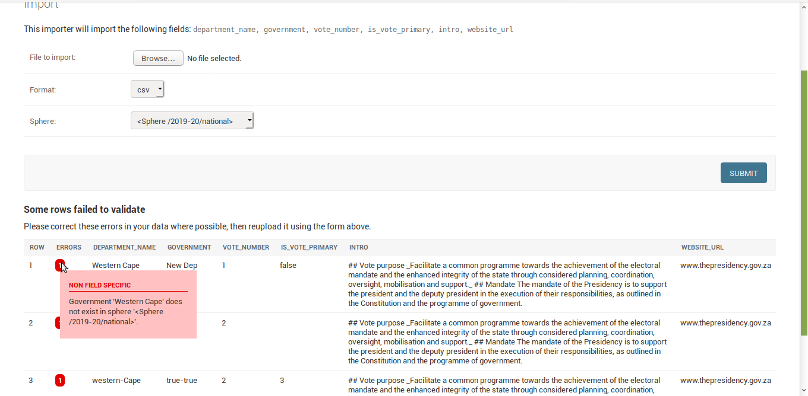
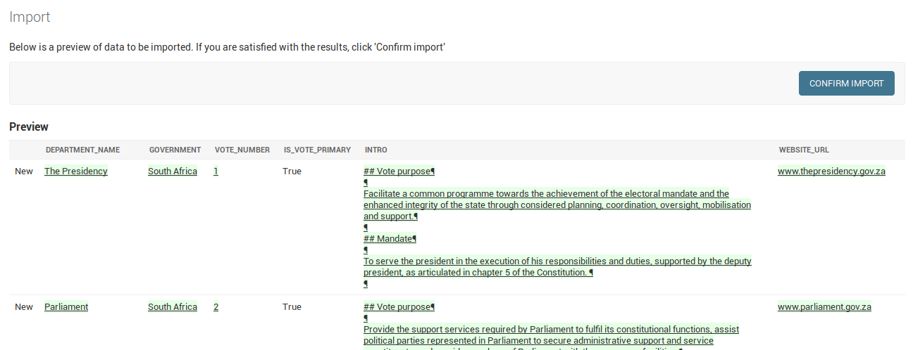

# Adding the new financial year, sphere, government, and departments

### Admin Interface

The new financial year, sphere, government, and departments must be added to the Data Manager

These items are added using the [Data Manager admin interface](https://datamanager.vulekamali.gov.za/admin/) under the "Budget Portal" section

### Add a new Financial Year

The "Slug" of a financial year is the hyphenated form, e.g. 2019-20

### Add a new Sphere

Spheres are repeated each financial year to help structure the data

In this case, add the National sphere. Select the the new financial year that the sphere is related to.

Each sphere has at least one government that the departments are part of

### Add a new Government

Add the new government. The government and sphere are used to identify data and documents specific to national government, as opposed to consolidated national and provincial finances together.

### Add new Departments

Departments are related to the government as defined in a given financial year. That helps to distinguish information related to a department's configuration in that year, and show historical information following function shifts.

Departments can be added using the admin form. Since it can take a lot of time to add all the metadata for all the departments, this can be done in bulk by uploading a CSV file from either the admin interface or a [command line](https://github.com/vulekamali/datamanager#loading-departments-in-bulk).

* Departments that represent a budget vote must have _Is vote primary_ checked. Departments that are part of another department's budget vote must not, and must have the vote department's vote number.
* The department Introduction can be formatted using [Markdown syntax](https://daringfireball.net/projects/markdown/syntax)

#### Adding/editing departments individually

#### Adding/editing departments in bulk

The departments section in the admin interface links to an [import screen](https://datamanager.vulekamali.gov.za/admin/budgetportal/department/import/). CSV files with the following columns can be uploaded:

* `government` - government name
* `department_name`
* `vote_number`
* `is_vote_primary` - TRUE or FALSE \(optional\)
* `intro` \(optional\)
* `website_url` \(optional\)



[Markdown syntax](https://daringfireball.net/projects/markdown/syntax#header) must be used for formatting `intro`. e.g. 2 line breaks will result in new paragraphs. Use headings like `## Vote purpose`.

The interface will check your file for any errors and display errors that have been detected. You can reselect a file to upload after you have fixed the errors.  

If your file contains no errors, a preview of the data that will be imported will be shown. You can click on "Confirm Import" to do the import and create/edit the departments.

