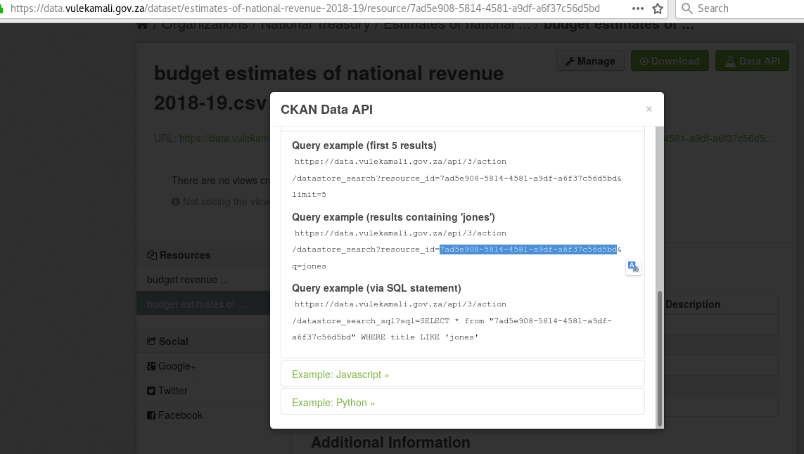
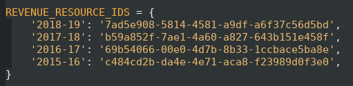

# Adding revenue sources data

Download the spreadsheet from the Main Budget Statistical Annexures with the _Main budget: estimates of national revenue:  Summary of revenue_ table.

In 2018-19 it was [\(Excel T2\)](http://www.treasury.gov.za/documents/national%20budget/2018/TimeSeries/Excel/Table%202%20-%20Main%20budget%20estimates%20of%20national%20revenue.xlsx) under _Main budget estimate of national revenue: Tables 2 & 3 of budget review statistical annex_ on the [2018 budget excel document page](http://www.treasury.gov.za/documents/national%20budget/2018/excelFormat.aspx).

Transform the human-readable table into a machine-readable table with the following structure:

* One amount column, one fact per row. That means a row for each unique combination of first and second level categories, each financial year, and each phase.
* Repeat the top level of category for each second level category, each in their own column
* Exclude top level category subtotals, we can produce them from the sum of the subcategories
* one financial year

For example, the 2018-19 table resulted in the following

| category\_one | category\_two | financial\_year | phase | amount |
| :--- | :--- | :--- | :--- | :--- |
| Taxes on income and profits | Personal income tax | 2018-19 | Before tax proposals | 498334600000 |
| Taxes on income and profits | Personal income tax | 2018-19 | After tax proposals | 505844600000 |
| Taxes on income and profits | Personal income tax | 2018-19 | Revised estimate | 0 |
| Taxes on income and profits | Personal income tax | 2018-19 | Actual collection | 0 |
| Taxes on income and profits | Corporate income tax | 2018-19 | Before tax proposals | 231568700000 |

Save this as a CSV and upload as a resource to the Datastore

Find the Resource ID on the popup after clicking the Data API button on the CSV resource page

Add the new resource ID to the mapping of financial year to revenue resource IDs in the Data Manager's `models.py`

This will allow the Data Manager to find revenue estimate data for the new financial year.

