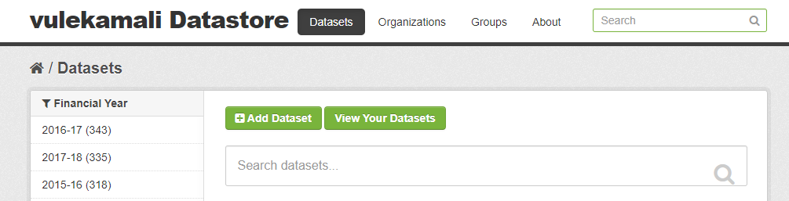
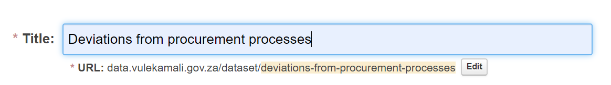
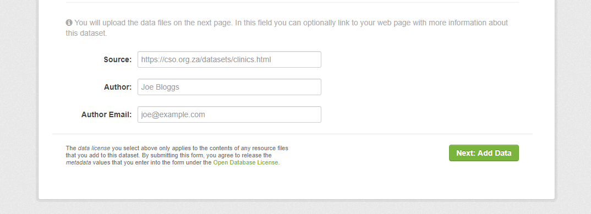
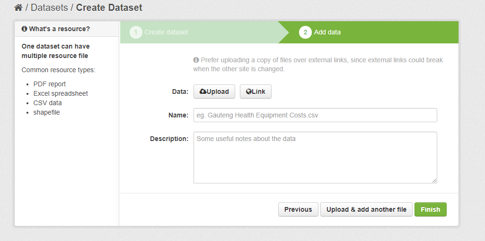
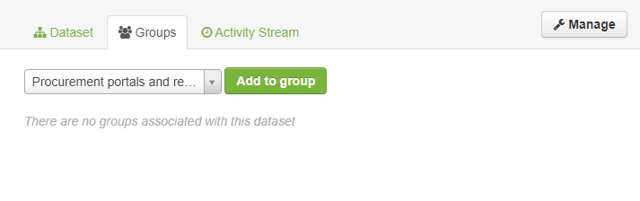

# Add external resource overview

#### Instruction Video



#### Step-by-step guide

1. Go to [https://data.vulekamali.gov.za/](https://data.vulekamali.gov.za/)
2. Sign Up or Sign In
3. Go to the **Datasets** tab in the navigation bar
4. Click on **Add Dataset**

You will be presented with a list of empty fields to be filled. Apart from the **Title**, all of the other fields are optional and will only be shown if they are filled in.


After adding the **Title**, ensure that the **slug** that is automatically generated is human-readable and clear.


5. Fill up the appropriate fields for the dataset that is being created.


The other fields can take some formatting using the format called [**Markdown**](https://www.markdownguide.org/)**.** This format can especially be used in this case for bullet points or numbering.


6. Scroll to the bottom and click on **Next: Add Data**

7. Links and other assets that needs to be uploaded should go on the next page as a resource. One dataset can have more than one resource.

8. Click on **Upload** to add a new asset \(example: file, image, screenshots, etc\) or **Link** to add a link. Give the resource a **Name** that represents the resource being added to the dataset.

9. To add another resource, click on **Upload & add another file** or/and click **Finish** when done.

10. To edit any of the added information or assets, go back to the specific dataset, click on **Manage** on the top right, and edit the text or resources as required.

11. Add the dataset to a **Group**  in the Groups tab and wait for it will be uploaded to [https://vulekamali.gov.za/datasets](https://vulekamali.gov.za/datasets) under that category

