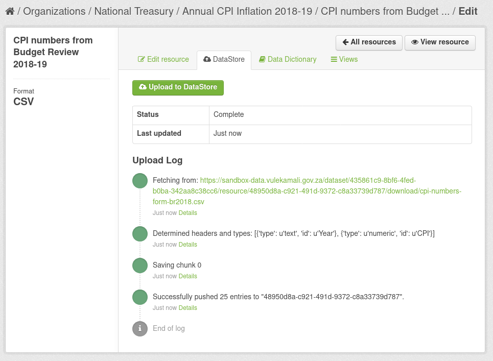
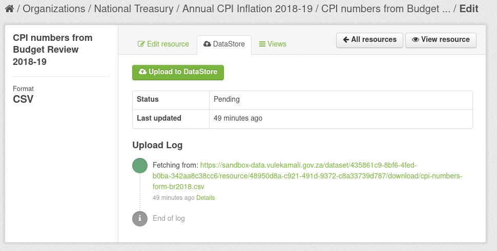

# CKAN Datastore

The CKAN Datastore automatically provides an API to the data in CSV and Excel resource files below a certain size, and with with unique column names in the first row of the first worksheet. Other worksheets are ignored.

The Datapusher service is used to import resources to the Datastore automatically when uploaded.

## Checking that a resource has been imported successfully

You can check the status of importing a resource to the datastore on the DataStore tab when editing the resource. You can find this logged in as an admin as follows:

1. View the dataset page
2. Click on the resource
3. Click on Manage
4. Click on the DataStore tab

A successfully imported resource shows one or more log items with `Successfully pushed n entries` so that all the n's should add to the data rows in the resource.


Some issues might be resolved by clicking Upload to DataStore. NOTE that it will only actually upload once per hour - check the Last updated time.


Usually when something goes wrong, an error message will be shown in the Update Log.

