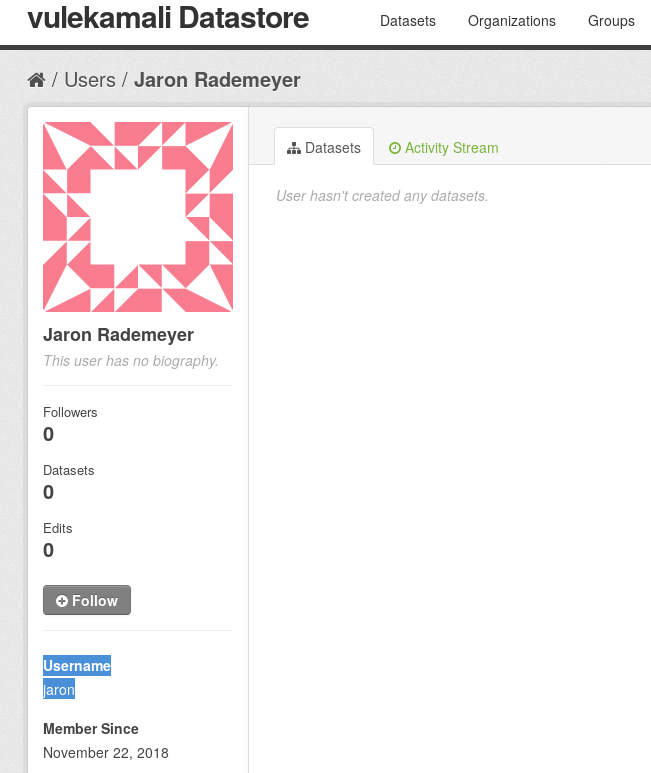

# Adding Datastore Admin users

Datastore admins can make other users admins.

Sysadmins have complete access to modify anything and anyone, and [require technical access to the Datastore installation](https://docs.ckan.org/en/2.7/sysadmin-guide.html#creating-a-sysadmin-account).

To allow a user to maintain datasets of a particular organisation, as a Sysadmin or an Organisation Admin, visit the relevant Organisation, click on Manage \(top right\), and [add them as a member with the appropriate role. ](https://docs.ckan.org/en/2.7/maintaining/authorization.html)

## Getting the user's username

Ask them to click Login on the Datastore \(top right\), complete the registration process if they haven't yet, then provide you with their username. They can find their username by clicking on their profile link at the top right, then looking for their Username on the bottom left

